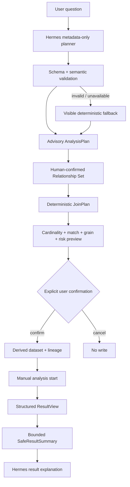

# InsightEase

> An agentic business analytics platform that separates LLM reasoning from deterministic data execution.


InsightEase helps an analyst turn a natural-language business question into a reviewable data plan, a safely constructed analysis dataset, a deterministic analysis, and a bounded AI explanation. It is designed for questions that span uploaded CSV/Excel tables without turning the model into an automatic SQL or execution agent.

The flagship demo asks:

> 最近一个月新客转化表现为什么下降？请比较不同营销渠道的转化表现，并帮我定位主要原因。

Hermes proposes an advisory `AnalysisPlan` from bounded metadata. InsightEase validates every referenced dataset, field, and relationship; a user reviews the relationships and Join risk; pandas executes only the confirmed JoinPlan; existing analysis modules produce a structured ResultView; and Hermes sees only a bounded `SafeResultSummary` for explanation.

## Core architecture



Safety properties:

- Relationship inference is metadata-based and requires review.
- A Relationship Set is allowed planning context, not an execution plan.
- Hermes cannot execute joins, analyses, SQL, or source mutations.
- Join Preview reports actual cardinality, match/null/duplicate rates, row multiplier, grain shift, and risk before persistence.
- Preview creates no dataset; confirmation creates a new derived dataset with source lineage.
- Analysis pages are prefilled but never auto-run.
- Result explanation receives a bounded summary instead of raw dataset rows or the full result payload.
- Invalid or unavailable live output falls back visibly; the UI never disguises fallback as Hermes Live.

## Flagship demo and ground truth

The public, synthetic pack lives in [`manual-test-data/demo-v1`](manual-test-data/demo-v1/README.md). It is generated with seed `20260903` and contains users, orders, marketing touchpoints, and event logs.

Its fixed truth is:

- overall new-customer CVR falls from **24.0% to 18.8%**;
- social_ads traffic share rises from **15% to 40%** despite lower conversion;
- social_ads CVR falls from **16% to 10%**;
- its main within-channel leak is checkout → payment success;
- users LEFT JOIN orders is a real 1:N grain shift and produces **2,054 rows from 2,000 users**.

See the generated [`GROUND_TRUTH.md`](manual-test-data/demo-v1/GROUND_TRUTH.md), [demo script](docs/interview/FLAGSHIP_DEMO_SCRIPT.md), and [E2E acceptance record](docs/qa/P0D_E2E_ACCEPTANCE.md).

## Product surfaces

### Dataset catalog and profiling

Upload owned CSV/Excel files, inspect bounded previews and schema profiles, search/group datasets, and review quality and analysis-use hints.


### Relationship-aware AI Workbench

Build a topic-scoped Relationship Set, distinguish connected and reference tables, ask a business question, and inspect required/candidate datasets, fields, metrics, assumptions, readiness, and provider source.


### Deterministic data preparation and analysis

For a two- or three-table plan, the Analysis Dataset Builder constructs JoinPlan steps only from confirmed equality relationships. The backend bounds input/output sizes, blocks unsafe expansion, preserves source files, and records derivation lineage. Users then manually run an existing workflow such as statistics, attribution, forecast, path analysis, data overview, or preprocessing.


### Bounded AI follow-up

ResultView can be explicitly brought back to AI Workbench. Module-specific metrics, small previews, and caveats form `SafeResultSummary`; full raw results and source rows stay outside the assistant boundary.


## Technology

- Frontend: React 19, TypeScript, Vite, Tailwind CSS, shadcn/Radix, ECharts.
- Backend: FastAPI, Pydantic, SQLAlchemy, pandas, MySQL.
- Storage: local disk or optional OSS for files; MySQL for metadata/history.
- Assistant: Hermes-compatible live planning and explanation behind the backend, strict contracts and semantic validation, deterministic fallback.

V1 uses bounded in-process dataframe execution. It is not an autonomous SQL agent, distributed engine, database discovery platform, or enterprise governance product.

## Local development

Prerequisites: Node.js/npm, Python, and a reachable MySQL instance.

Backend:

```bash
cd insightease-backend
python -m venv .venv
source .venv/bin/activate
pip install -r requirements-dev.txt
cp .env.example .env
# Configure local MySQL credentials; inject Hermes secrets only through this uncommitted environment.
uvicorn app.main:app --reload
```

Frontend:

```bash
cd app
npm ci
# For a configured real provider, set VITE_ASSISTANT_RUNTIME_PROVIDER=hermes_live in .env.local.
npm run dev
```

Live planning and explanation additionally require backend-only `HERMES_ASSISTANT_ENABLED=true`, `HERMES_ASSISTANT_MODE=live`, provider base URL/token, and a supported model. `disabled` and `dry_run` do not satisfy live acceptance.

## Verification

```bash
python3 manual-test-data/demo-v1/scripts/generate_demo_data.py
insightease-backend/.venv/bin/python manual-test-data/demo-v1/scripts/validate_demo_data.py

cd app
npm run lint
npm run build

cd ../insightease-backend
.venv/bin/python -m pytest -q
```

Release/demo operators should also follow the [environment check](docs/qa/P0D_DEMO_ENV_CHECK.md) and [reset procedure](docs/qa/P0D_DEMO_RESET.md). Automated checks do not replace the real-provider browser E2E.

## Current release evidence

- P0C baseline: frontend build passed; lint had zero errors and 355 historical warnings; backend had 105 passed and 6 skipped tests.
- P0D offline evidence: deterministic generation, pandas reference validation, and the product Join engine all agree on the flagship data.
- The 2026-09-03 P0D environment had no configured Hermes provider or reachable MySQL/backend/frontend runtime, so the real-provider browser gate and new `01`–`08` screenshot sequence remain open. The honest readiness decision is recorded as **V1.0 NOT READY** until those gates are rerun.

## Project documentation

- [Current architecture](docs/CURRENT_ARCHITECTURE.md)
- [Known limitations](docs/KNOWN_LIMITATIONS.md)
- [Interview guide](docs/interview/INSIGHTEASE_INTERVIEW_GUIDE.md)
- [Resume bullets](docs/interview/RESUME_BULLETS.md)
- [P0D phase log](docs/phase-logs/V1_0_P0D_E2E_DEMO_PORTFOLIO_FINALIZATION.md)

Historical design and phase records remain under `docs/`; they explain how the boundaries evolved but do not override this README or the current architecture document.
