# InsightEase

> AI-assisted statistics and analytics platform for dataset understanding, relationship-aware analysis planning, structured result rendering, and safe AI result follow-up.

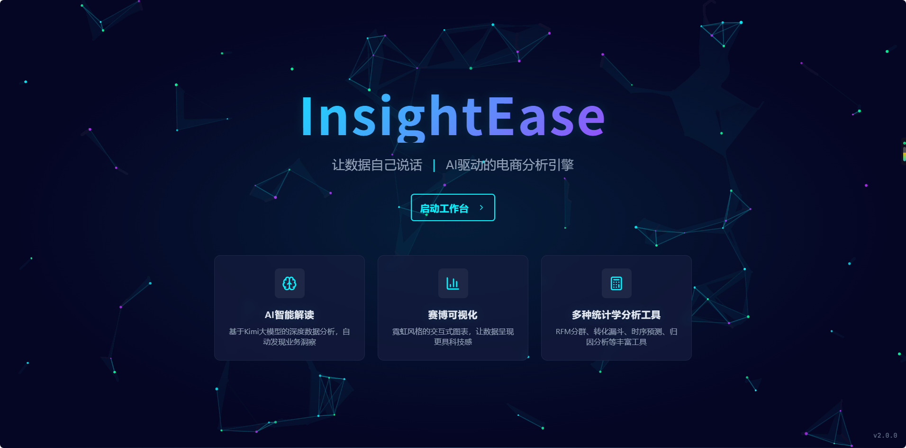

## Overview

**InsightEase** is an AI-assisted data analysis platform designed for business analytics, experimentation, forecasting, attribution, path analysis, and statistical exploration.

The platform helps users move from raw uploaded datasets to structured analytical insights through an end-to-end workflow:

```text
Upload datasets
→ Understand dataset structure
→ Classify and organize datasets
→ Infer relationships between tables
→ Generate AI-assisted analysis plans
→ Execute statistical / business analysis
→ Render structured results
→ Bring results back to AI Workbench for explanation and next-step suggestions
```

Unlike a simple AI chat interface, InsightEase uses a bounded, metadata-first assistant architecture. The AI Workbench does not blindly consume raw data or automatically execute analysis. It works with dataset metadata, confirmed relationship context, safe result summaries, and explicit user actions.

---

## Product Preview

### Dashboard

The dashboard provides a high-level overview of uploaded datasets, analysis tasks, storage distribution, recent activity, and analysis type distribution.

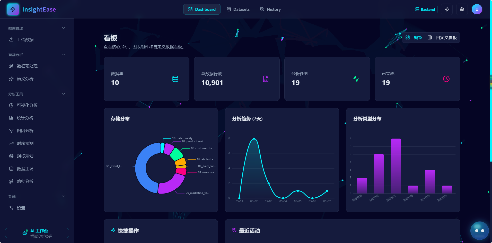

### Dataset Upload

Users can upload CSV / Excel files. The backend parses schema information, stores metadata, and makes datasets available for downstream analysis.

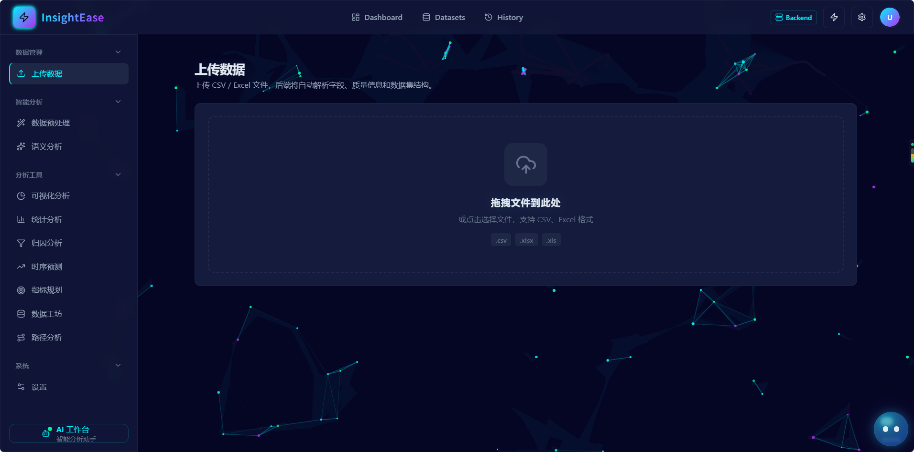

### Dataset Catalog

The Dataset Catalog supports dataset search, grouped views, business-topic classification, data-type labels, analysis-use tags, and quality scores.

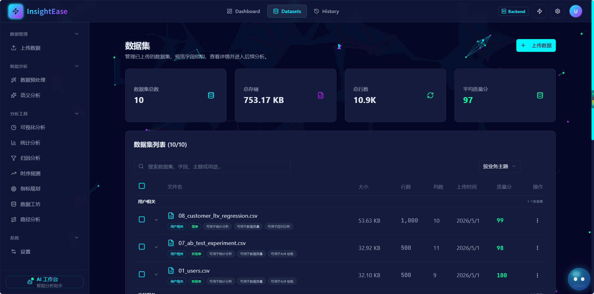

### Dataset Preview

Users can expand datasets to inspect bounded previews and schema-level information before running analysis.

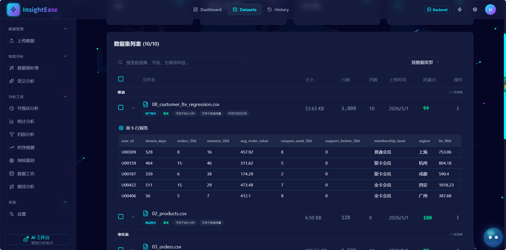

---

## Core Features

### 1. Dataset Upload and Management

InsightEase supports the full dataset lifecycle from upload to downstream analysis.

Key capabilities:

- CSV / Excel upload
- Dataset metadata extraction
- Dataset list and preview
- Search and grouped dataset views
- Business-category and analysis-use labels
- Quality score display
- Dataset download and deletion

The Dataset Catalog is designed as a deterministic metadata layer. It can classify datasets by business topic, data type, and likely analysis usage using filename, schema fields, row/column counts, and exposed metadata.

---

### 2. Data Preprocessing

The DataWorkshop / preprocessing module supports common data cleaning workflows before analysis.

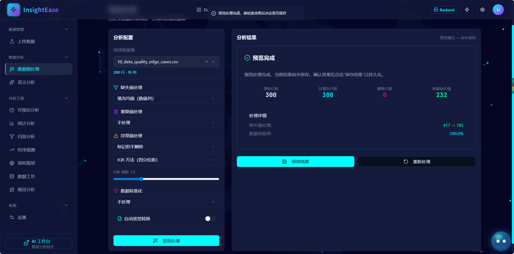

Supported operations include:

- Missing value handling
- Duplicate handling
- Outlier handling
- Standardization options
- Preview-before-save workflow
- Save processed result as a new dataset

The design follows a backend-processing-first model: preprocessing is previewed and saved through backend APIs rather than being silently executed in the browser.

---

### 3. Statistical and Business Analysis Modules

InsightEase provides multiple analysis modules for different business and statistical use cases.

Current modules include:

- Descriptive statistics
- Visualization analysis
- Forecasting
- Attribution analysis
- Path analysis
- Data overview and field profiling
- Data preprocessing
- Analysis history management

#### Statistics ResultView

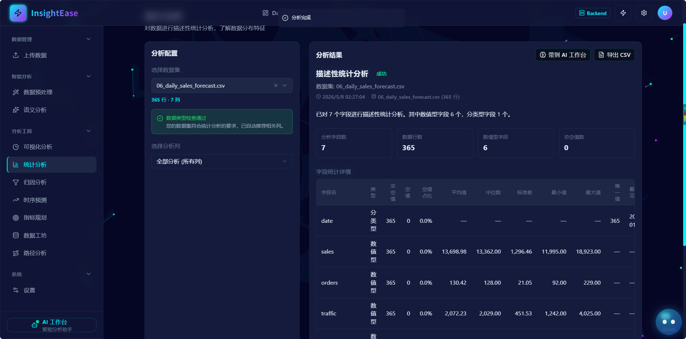

#### Forecast Analysis

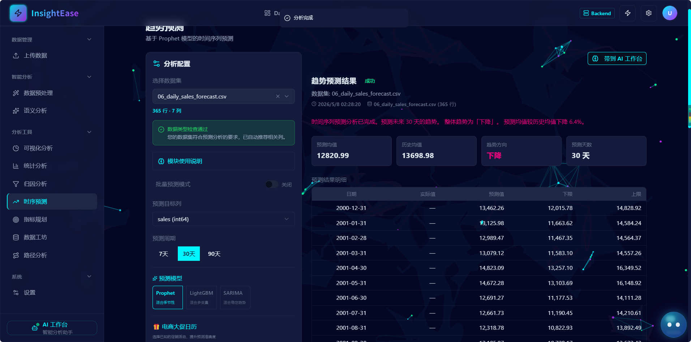

#### Attribution Analysis

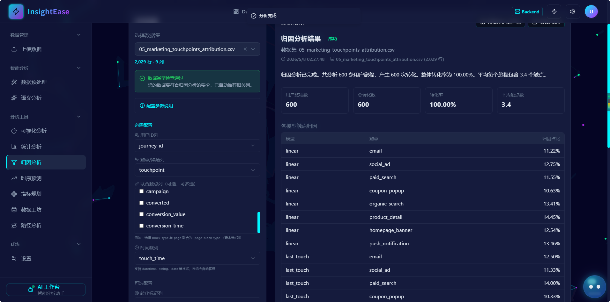

#### Path Analysis

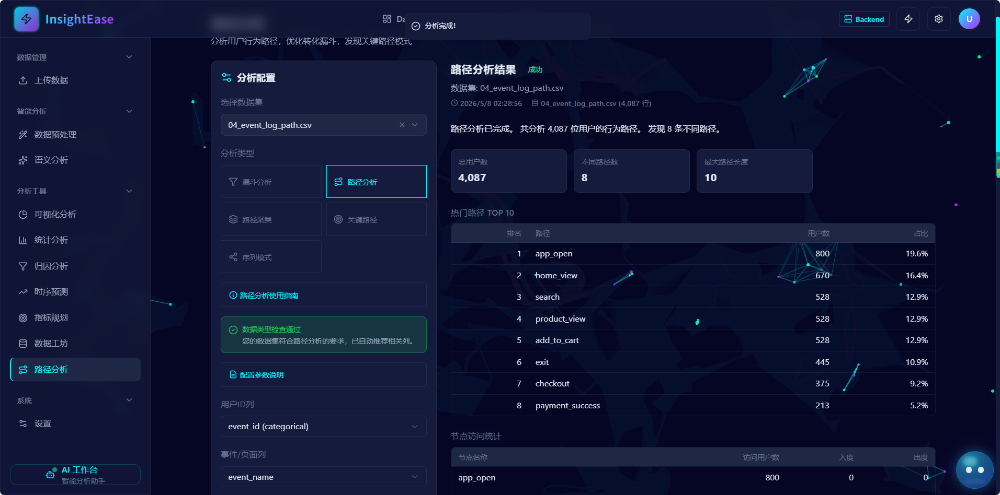

---

## AI Workbench

AI Workbench is the main assistant shell of InsightEase.

It connects dataset context, relationship context, analysis history, structured planning, and result follow-up into a unified interface.

### Relationship-aware Context

Users can create and manage **Relationship Sets**, which represent topic-scoped dataset graphs.

A Relationship Set may include:

- connected dataset nodes
- confirmed relationship edges
- isolated / reference tables
- high-risk relationship warnings

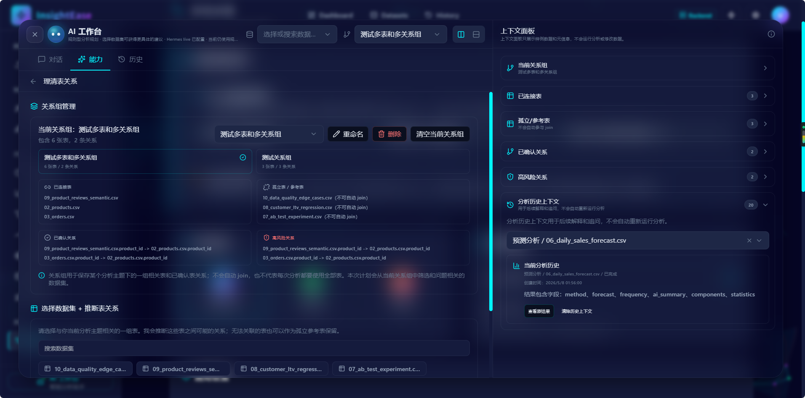

Relationship Sets are used as **allowed context** for planning. They do not automatically join datasets or execute analysis.

---

### AI-assisted Analysis Planning

Users can ask natural-language business questions, and AI Workbench converts them into structured analysis plans.

With the live runtime enabled, bounded metadata is sent through the InsightEase backend to Hermes and the returned plan is validated against the exact dataset, field, and Relationship Set context. Invalid or unavailable live responses fall back to the deterministic planner.

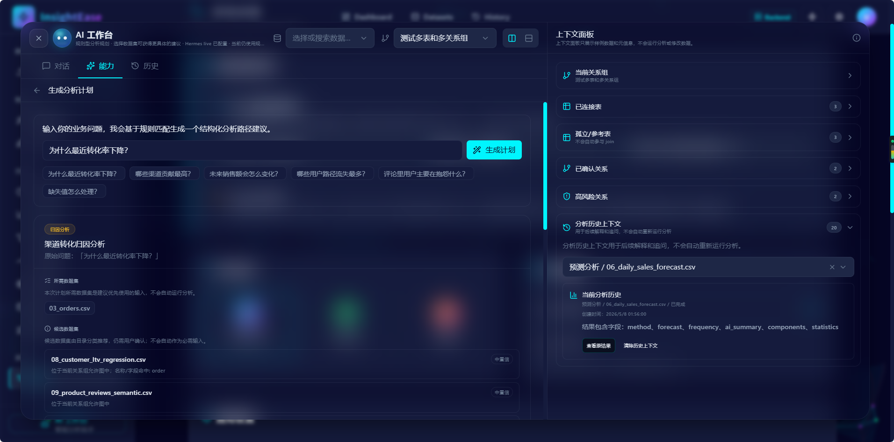

The generated plan distinguishes:

- required datasets
- candidate datasets
- suggested fields
- assumptions
- warnings
- recommended target analysis module

The assistant can prefill target analysis pages, but the user must still review the configuration and manually start the analysis.

**Hermes live planning is advisory. Plans require user confirmation. Multi-table execution is not yet implemented. Relationship Sets are context graphs, not executed joins.**

---

### Safe Result Follow-up

Analysis results can be brought back into AI Workbench for explanation, risk identification, next-step suggestions, and report drafting.

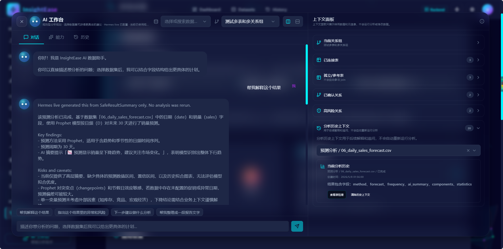

The result follow-up flow is based on `SafeResultSummary`, a bounded summary contract. It avoids sending full raw result tables or raw dataset rows into the assistant context.

---

## End-to-End Product Workflow

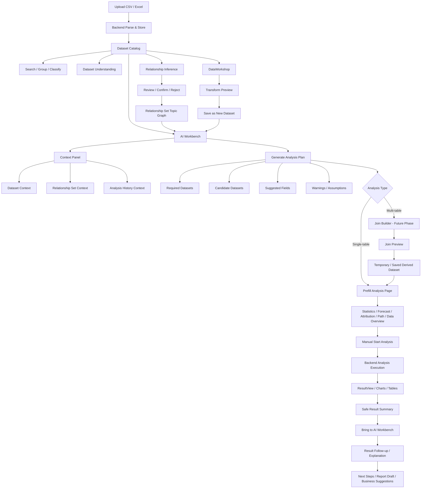

---

## System Architecture

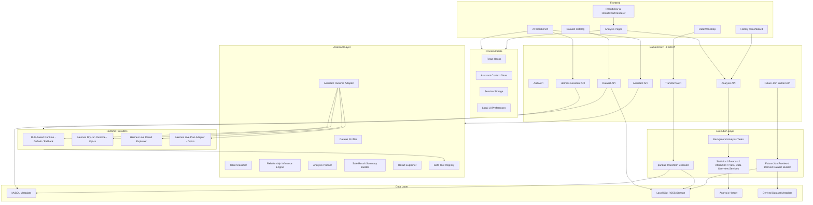

---

## AI Analysis Pipeline

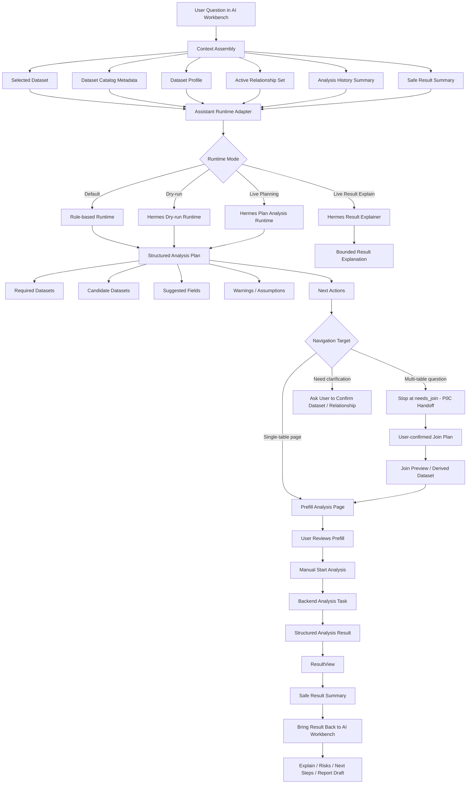

---

## Relationship Sets and Multi-table Context

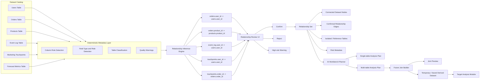

---

## Safety Boundaries

InsightEase is designed around safe AI-assisted analysis rather than uncontrolled agent execution.

Current boundaries:

- No silent joins
- No automatic analysis execution
- No arbitrary SQL execution from AI
- No source dataset mutation
- No raw dataset rows sent to AI by default
- Relationship Sets are context graphs, not execution plans
- Result follow-up uses bounded `SafeResultSummary`
- Execute/write actions require explicit user confirmation

---

## Tech Stack

### Frontend

- React 18
- TypeScript
- Vite
- Tailwind CSS
- shadcn/ui
- Radix UI
- ECharts
- Axios
- React hooks + local/session storage for UI state

### Backend

- FastAPI
- Python 3.11
- pandas
- SQLAlchemy
- MySQL
- Local disk / OSS storage
- BackgroundTasks for analysis execution

### AI / Assistant Layer

- Assistant Runtime Adapter
- Rule-based runtime by default
- Hermes dry-run runtime opt-in
- Hermes live structured planning opt-in with deterministic fallback
- Hermes live result explanation boundary
- Safe Tool Registry
- Safe Result Summary
- Metadata-first planning context

---

## Project Status

This project is under active development.

Completed capabilities include:

- Dataset upload and management
- Dataset Catalog search and grouped views
- Data preprocessing preview and save workflow
- Multiple analysis modules
- Unified ResultView rollout
- ResultChartRenderer for basic chart rendering
- Analysis History Catalog
- AI Workbench shell
- Relationship Set management
- Relationship-aware analysis planning
- Prefill navigation to analysis pages
- Safe result handoff to AI Workbench
- Deterministic result follow-up
- Hermes dry-run / live-planning / live-result-explainer safety boundary
- Validated single-table prefill and multi-table `needs_join` handoff

Planned next-stage capabilities:

- AI error explainer
- Multi-table Join Builder
- Backend join preview
- Temporary / saved derived analysis datasets
- Productization, permissions, audit logs, and large-dataset handling
- Dashboard builder and report generation

---

## Demo Scenarios

### 1. Dataset Catalog to Forecast Plan

```text
Datasets
→ Group by analysis usage
→ Find forecast dataset
→ Open AI Workbench
→ Ask: "预测未来销售额趋势"
→ Generate forecast plan
→ Navigate to Forecast page with prefilled dataset
```

### 2. Relationship Set to Channel Conversion Plan

```text
AI Workbench
→ Create Relationship Set from users / orders / event log / marketing touchpoints
→ Ask: "分析各渠道转化率"
→ Review required datasets and candidate datasets
→ Navigate to Attribution or Statistics only after required datasets are confirmed
```

### 3. Result to AI Workbench Follow-up

```text
Run Statistics / Forecast / Attribution / PathAnalysis
→ Click "带到 AI 工作台"
→ AI Workbench receives SafeResultSummary
→ Ask: "帮我解释这个结果"
→ Ask: "有哪些异常或风险？"
→ Ask: "整理成报告文字"
```

---

## More Screenshots

### History Catalog

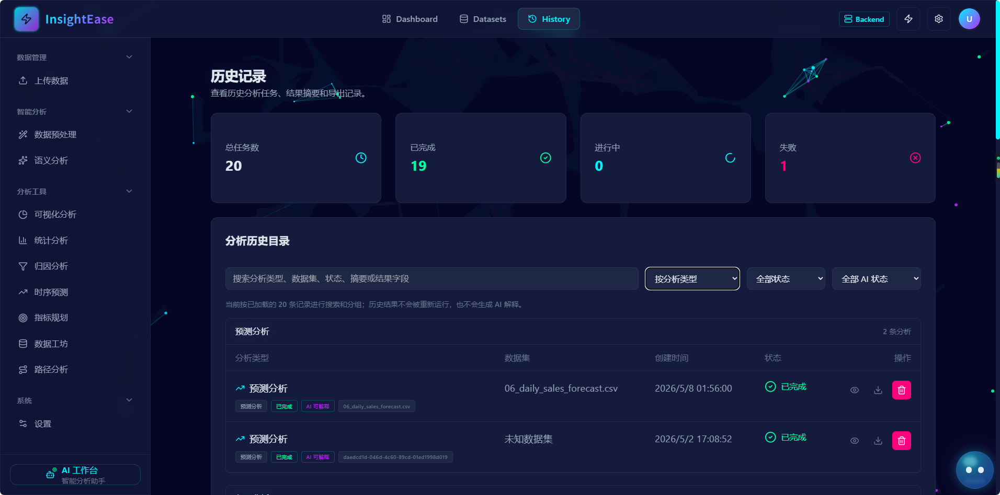

### Visualization Analysis

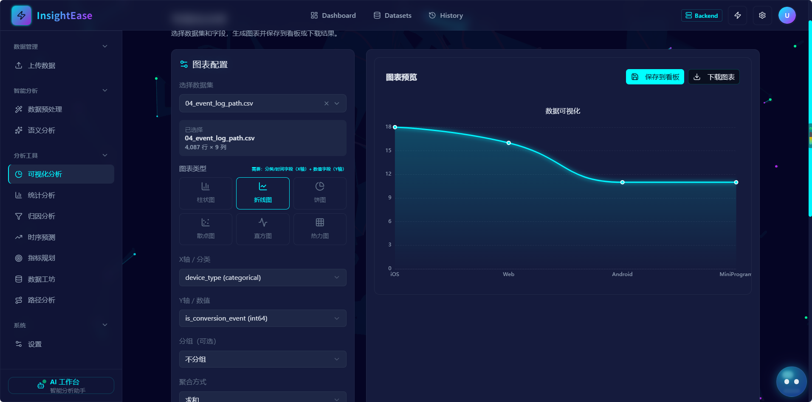

### Settings and Backend Processing Mode

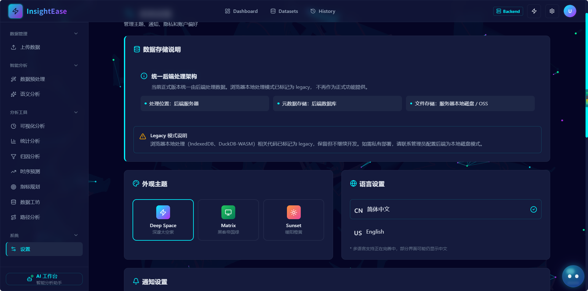

---

## Local Development

> The exact local startup command may vary depending on frontend/backend environment configuration.

### Frontend

```bash
cd app
npm install
# Optional: set VITE_ASSISTANT_RUNTIME_PROVIDER=hermes_live in an uncommitted local env file.
npm run dev
```

### Backend

```bash
cd insightease-backend
pip install -r requirements.txt
# Copy .env.example to an uncommitted local env file and inject Hermes secrets there.
uvicorn app.main:app --reload
```

Live planning requires `HERMES_ASSISTANT_ENABLED=true`, `HERMES_ASSISTANT_MODE=live`, a backend-only provider URL/token, and the explicit frontend runtime setting above. Without those settings, planning remains deterministic.

### Build Check

```bash
cd app
npx tsc --noEmit
npm run build
```

---

## Screenshot File Checklist

Place interview/demo screenshots under:

```text
docs/assets/interview/
```

Recommended file names:

```text
hero-landing.png
dashboard-overview.png
upload-data.png
dataset-catalog.png
dataset-preview.png
history-catalog.png
visualization-analysis.png
data-workshop-preview.png
statistics-resultview.png
attribution-result.png
forecast-result.png
path-analysis-result.png
settings-architecture-status.png
ai-workbench-relationship-set.png
ai-workbench-analysis-plan.png
ai-workbench-result-followup.png
```

---

## Repository Structure

```text
InsightEase/
  app/                         # Frontend application
  insightease-backend/          # Backend API and analysis services
  docs/                         # Architecture, roadmap, design docs, phase logs
  docs/assets/interview/        # README screenshots
  manual-test-data/             # Demo and QA datasets
```

---

## Notes

This repository includes both product code and detailed development documentation.

- Root `README.md`: project showcase for visitors and interviewers.
- `docs/README.md`: internal documentation index for developers and AI coding assistants.
- `docs/design/`: architecture and product design contracts.
- `docs/phase-logs/`: phase-by-phase development records.
- `docs/qa/`: reusable QA recipes and demo scenarios.
