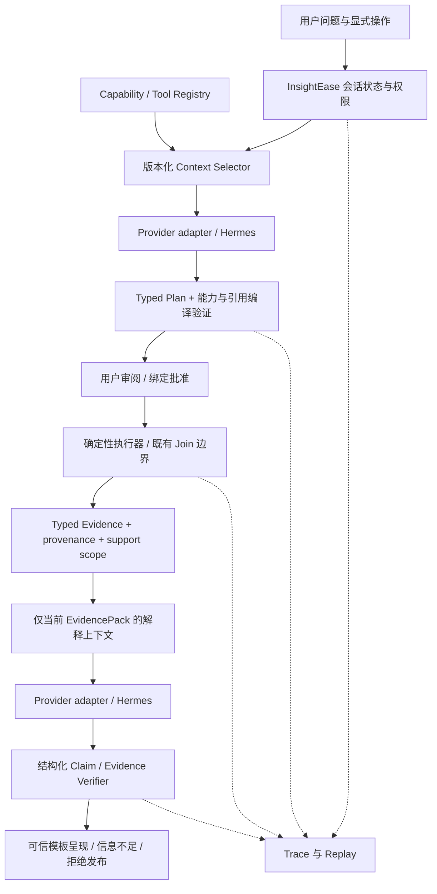

# P0D-H0 — Business Analysis Agent Architecture Review

## H1 用户批准修订（2026-09-07，优先于下文历史提案）

H0 总体方向已批准；本次仅批准 H1 实施。下文 CURRENT/OBSERVED 是 H0 审计时点事实，PROPOSED 仍不是实现声明；H1 当前实现另记于 P0D_H1_CAPABILITY_EXECUTION_IMPLEMENTATION.md。

- **D03 APPROVED**：baseline-rate 固定公式；mix=-2.56pp、within=-2.64pp，两者接近，within 绝对值略大，流量结构仍是重要因素。禁止无指标的唯一主因。每项排名必须含 ranking_metric、ranking_universe、direction、coverage；区分 channel_cvr_delta、conversion_count_delta、within_effect_pp、mix_effect_pp。保留原始 generator/真值历史，不改公式迎合叙事。
- **D04 APPROVED WITH MODIFICATION**：conversion_decline_diagnosis@1 必需 cohort CVR、channel CVR、mix/within；funnel 为 conditional optional。缺事件证据允许 core 成功且 optional coverage 不完整，不能发布 checkout/payment/funnel claim。明确要求漏斗环节时，funnel evidence 升为该问题必需；H1 未实现则 unsupported。漏斗不再是 H1 blocker；旧 Gate 2 FAIL 不自动变 PASS。
- **D07 APPROVED WITH MODIFICATION (H4)**：Verified Claims + Bounded Narrative。Claim AST 与 deterministic grounding 校验事实；模型可调整顺序、组织语言、综合已验证 findings。Narrative 不得新增 metric、number、entity、ranking、causal statement 或 unsupported recommendation。H1 不实现解释、Claim AST 或 narrative。

日期：2026-09-07。性质：架构审计与决策材料；不是实现批准。

**P0D-H0 ARCHITECTURE REVIEW COMPLETE**
**IMPLEMENTATION NOT STARTED**

## 1. 审计边界与事实标记

- **CURRENT**：本机当前工作树可直接验证的实现，引用文件和符号。不是对未读取的服务器运行时作保证。
- **OBSERVED**：已有 Gate 1 / Gate 2 QA 及保存证据中的现象。本轮没有重新测试，也没有再次调用 provider。
- **PROPOSED**：本轮设计、默认值、验收门槛和未来模块；均未实现。各“建议”不代表已经批准。
- 对无法从静态代码确定的运行时先后顺序，明确标记为“未定位”，不把推测写成根因事实。

**CURRENT — 审计基线**：仓库 `C:\Users\cc249\InsightEase`，分支 `codex/v1.0-p0d-e2e-demo-portfolio`，HEAD `4025c971e229c86ac95035d5cc2edba4401cf442`。开始时已有 `app/src/pages/AIWorkspace.tsx` 的四处导航参数修改，以及未跟踪的 `docs/qa/P0D_FULL_BROWSER_E2E.md`。导航修改属于前一阶段，本轮保留；不能称为本轮实现，也不能称为已通过新的浏览器验收。

本轮仅新增这三份架构文档；不修改生产代码、配置、QA 历史、运行行为；不进行浏览器点击、测试、commit、push、模型路由或新 analyzer 开发。既有服务和数据保持原状。

配套材料：[契约与上下文设计](P0D_H0_CONTRACTS_AND_CONTEXT_ARCHITECTURE.md)、[决策登记与实施路线](P0D_H0_IMPLEMENTATION_DECISION_REGISTER.md)。后者统一记录每项推荐的 solves / does_not_solve / cost / complexity / V1.0 recommendation。

## 2. 顶层诊断

**CURRENT + OBSERVED**：InsightEase 已具有受限的规划入口、字段/关系引用验证、确定性分析服务、Join 风险检查和用户执行入口。Gate 1 证明真实 Hermes 链路可生成通过现有验证的计划。问题不再是连接 provider，而是**计划要求、执行能力、结果语义和可发布结论之间没有可验证的闭环**。

当前链路中的四个“成功”不能互相代替：

| 层次 | CURRENT / OBSERVED 已证明 | 尚未证明 |
|---|---|---|
| 传输成功 | 真实 DeepSeek 回包，fallback=false | 回答结构与事实可靠 |
| 计划合法 | 字段存在、关系来自提交的允许图、类型在枚举中 | 执行器能产出问题所需指标 |
| 计算成功 | 派生文件与 pandas 一致；归因数值一致 | 粒度和业务方法适合问题 |
| 解释生成 | 三次真实解释回包 | 每条结论属于证据支持范围 |

**PROPOSED**：业务 Agent 的可信单位应是“有版本的能力 → 经批准的执行规格 → 有来源的证据包 → 经验证的结论”，而不是一段看起来合理的模型回答。

## 3. 真实实现索引

以下均为 **CURRENT**，路径相对仓库根；行号为审计时定位点，符号名为稳定检索入口。

| 编号 | 代码/材料 | 已读取的边界 |
|---|---|---|
| C01 | `insightease-backend/app/schemas/assistant.py:149,210` | BoundedPlanningContext、AssistantAnalysisPlan；strict extra=forbid，字段、指标、readiness |
| C02 | `insightease-backend/app/services/hermes_validation_service.py:89,123,304,412` | 请求大小/禁用字段；计划引用与 next action 归一化；摘要的尺寸限制 |
| C03 | `insightease-backend/app/services/hermes_live_service.py`，`plan_analysis_with_live_hermes`、`parse_hermes_explain_response`、`_extract_response_candidate`、`_request_json_sync` | provider 请求、完整计划 schema、宽松解释解析、网络异常 |
| C04 | `insightease-backend/app/api/v1/endpoints/hermes.py:43,152` 及 `hermes_plan_analysis` | health、认证入口、live/dry-run/disabled、后端 fallback |
| C05 | `app/src/lib/assistant/hermesAssistantRuntime.ts:25`、`ruleBasedAssistantRuntime.ts`、`getAssistantRuntime.ts`、`app/src/api/assistant.ts` | 后端调用、前端二次 fallback、125s/65s 超时 |
| C06 | `app/src/pages/AIWorkspace.tsx:329,395,497,590,618,733,815`；`resultFollowupResponder.ts:10` | 并行结果状态、存储恢复、会话切换、handoff、关键词 routing |
| C07 | `app/src/lib/assistant/aiWorkbenchHandoff.ts`、`resultHandoffActions.ts`；`AIWorkbenchContextPanel.tsx:255,266` | sessionStorage + 双事件；异步历史加载、结果摘要选择 |
| C08 | `app/src/pages/Attribution.tsx:174,192,378`；`prefillNavigation.ts`；`JoinBuilderPanel.tsx` | 字段预填、人工启动、结果 handoff、derived ID |
| C09 | `app/src/lib/assistant/safeResultSummary.ts:20,153,176,320`、`app/src/types/resultSummary.ts` | 有界通用摘要、嵌套数组降格、模块提示 |
| C10 | `insightease-backend/app/services/attribution_service.py:27,123`、`_generate_summary` | 用户分组旅程、转换标记、模型分摊、均值 |
| C11 | `insightease-backend/app/api/v1/endpoints/analysis.py:125,556,691`、`schemas/analysis.py`、`analysis_service.py`、`path_analysis_service.py:16` | 类型分派、自由 params、后台执行、描述统计、漏斗/路径 |
| C12 | `app/src/lib/assistant/joinPlanBuilder.ts:139`；`schemas/join.py`；`services/join_service.py:34,48,253`；`endpoints/join.py` | 2–3 表、LEFT/INNER、snapshot 匹配、所有权、预览/创建 |
| C13 | `app/src/hooks/useAssistantContext.ts:249,303`；`relationship_inference_service.py`；`boundedPlanningContext.ts:12` | 本地 Relationship Set、精确唯一性、元数据裁剪 |
| C14 | `app/src/lib/assistant/toolRegistry.ts`；`components/results/ResultView.tsx`；`adapters/attributionResultAdapter.ts` | UI 工具说明；结果渲染及展示适配，不是执行授权器 |
| C15 | `insightease-backend/tests/test_hermes_live.py`、`test_hermes_live_planning.py`、`test_join_service.py` | 既有测试覆盖范围，仅静态读取，未运行 |
| Q01 | [Gate 1 QA](../qa/P0D_REAL_HERMES_PLANNING_SMOKE.md) | 真实规划成功与此前超时、schema、semantic 失败 |
| Q02 | [Gate 2 QA](../qa/P0D_FULL_BROWSER_E2E.md) | Join/创建/执行、摘要/解释失败、未完成重复流程 |
| Q03 | `manual-test-data/demo-v1/GROUND_TRUTH.md`、该目录 `scripts/generate_demo_data.py` | 真值与分解公式、固定 seed、原始 demo 规则 |

Q02 是按进度追加的记录，早期“pending”段落随后被完成记录取代；审计采用最终 FAIL 和后续证据，不把早期 pending 当成当前运行状态。Q01 末尾历史判断“无需新核心功能”已被 Q02 的执行能力缺口否定，不能作为 H0 的预设结论。

## 4. 失败根因审查

### 4.1 合法计划没有能力覆盖证明

**CURRENT（C01–C03、C11）**：计划只有 `recommended_analysis_type` 和描述性的 metrics/aggregation；没有 capability_id/version、算子输入输出契约、要求产出的 evidence 类型。验证器确认字段存在、required/candidate 子集、关系连通与确认状态；未将 metric `rate` 编译成分子、分母、分组、时间窗口和 executor 参数。

`analysis_type='attribution'` 最终调用触点归因函数。它按 user_id 排序构建旅程，将贡献分给触点，计算整个输入的用户数和转化数。附加 `cohort_period` 只是拼入触点标签，不会产生各期用户分母或 mix/within 分解。描述统计服务也不是 cohort comparison。已有漏斗函数不等于具备跨期、跨渠道、用户 cohort 对齐的 funnel_compare 能力。

**OBSERVED（Q01/Q02）**：计划意图含渠道结构分解，但实际只得到 pooled CVR 21.4%；30 个模型×渠道周期贡献值正确，仍不能满足 24%→18.8% 的业务诊断。

**PROPOSED**：保留“advisory plan”与“executable plan”两个状态。只有编译器证明 capability 输出覆盖所有必需 evidence，且执行参数、粒度、口径已绑定，才能标为可执行。部分目标不支持时，返回 partial/unsupported；不得用近似分析类型静默替代。

**CURRENT 的另一处具体接口失配（C08）**：Attribution prefill 用 `dimension` 选择触点列、`time_column` 选择时间戳、`target_metric` 填 conversion_value_col；它不等同于 Gate 1 的 `group_column=acquisition_channel`、`time_column=cohort_period`、`target_metric=converted`。字段存在仍可能落入错误参数槽位。Gate 2 用人工配置恢复，未证明该自动映射已正确；未来 compiler 必须绑定明确的 conversion_flag、channel、cohort 与 timestamp 角色。

### 4.2 粒度约束止于警告，未进入分析前置条件

**CURRENT（C10、C12）**：Join 风险报告提供 `likely_detail` 和指标重复警告，但该 grain 没有成为 attribution 的强制 precondition。归因把输入每行都加入 `touchpoints`；平均触点数来自每用户行数，缺少转换列时甚至默认为 converted=true。转换列存在时使用最后一行的 bool，未证明列代表所选业务转化。

**OBSERVED**：LEFT Join 产生 2,054 行/2,000 用户；平均行数 1.027，经现有显示精度成为 1.03。这是注册渠道被订单行重复后的计数，不是完整营销触达轨迹。第三个解释据此建议优先 acquisition/first touch。

**PROPOSED**：将 represented_record_count 与 behavioral_touch_count 分开；后者必须有真正的事件/触达粒度证明、稳定事件标识与覆盖声明。Join 的 grain、列来源映射和基数进入执行契约；不满足时不能靠用户勾选风险提示解除业务语义约束。

### 4.3 有界摘要不等于有业务语义的证据

**CURRENT（C09）**：最多 8 metrics、3 tables、每表 5 行/12 列；`toSafeCell` 将数组转为 `N items`、对象转为 `N keys`。`summary.model_comparison` 中 Top3 嵌套数组正好进入该路径。`collectTopChannels` 无法从占位文本恢复成员。`SafeMetricSummary` 只有 label/value/unit/description，没有分母、population、粒度、来源版本、support scope。

**OBSERVED**：Hermes 收到“3 items”，不知道渠道名和值，前两问正式信息不足。

**PROPOSED**：不要扩大 raw result_data 的通道。由服务端针对注册的 output contract 生成 EvidencePack：有序 ranking 成员及其受控值、比较口径、总体规模、coverage 与 omission metadata。摘要可舍弃次要 evidence，不能舍弃一个结论必需的分母或支持限制。

### 4.4 Handoff 与 routing 是两个独立问题

**CURRENT（C06–C08）**：handoff 存 sessionStorage，先发 handoff event 再发 open event；消费函数读 storage，不使用事件 detail，设置多个 React state 后清理槽位。历史列表另行加载，selectedHistorySummary 也单独维护。`activeResultSummary = attached ?? selectedHistorySummary`，没有会话/结果版本统一约束。新会话只清部分 plan/UI 状态；切换历史会话主要替换 messages，没有原子切换所有 artifact。更换 selected history 时旧 attached summary 仍可能优先。

**OBSERVED**：按钮显示成功，但首个追问没有 active result；从历史手动选中后解释成功。**不能仅凭现有静态代码确定这一次丢失究竟由哪一个 effect/事件时序引起**；缺少当时带版本的 handoff ack/trace。架构根因可确认：没有原子 handoff acknowledgement、单一结果指针和版本约束；具体竞态触发点仍未定位。

另一个根因已明确：`detectResultFollowupIntent` 以“解释/建议”等关键词路由；unknown 无论是否在结果工作流都会进入 planning。加“解释”能绕过，但不解决状态问题。

导航事件字符串→`{path}` 的四处修改已经在工作树中，未提交且完整 prefill 流程尚未重新验收。它与 active result 丢失不是同一个 bug。

**PROPOSED**：单一 server-owned session state + artifact version + CAS transition；用户的消息送到当前 mode 的处理器。显式“开始新问题”可先切 mode，但普通词语不能覆盖应用状态。handoff 成功提示必须在服务器确认目标 result 已绑定后显示。

### 4.5 解释 schema 是包装，不是严格模型输出合同

**CURRENT（C03、C04、schemas/hermes.py）**：解释输入 `result_summary: Dict[str, Any]`；校验大小、禁用 key、表格上限，但不从数据库核对 evidence。模型输出 JSON 失败时，`_extract_response_candidate` 可以返回 `{'answer': content}`；parser 接受别名、转成字符串、截断列表、给默认 confidence，再包装成响应并设置 fallback=false。没有 finding→evidence 引用检查，也没有 supported claims 校验。

**OBSERVED**：第一个真实解释把 malformed JSON/code fence 作为 answer 文本呈现。后两次是可读文本；第三次数字正确但推论越界。

**PROPOSED**：schema 无效属于 generation_invalid，不能晋升为 verified answer。结构、引用、数值、结论范围各有独立 validation outcome；fallback/source 与 grounding status 正交。见契约文档的受控 Claim AST 和 abstention。

### 4.6 当前安全基础值得保留，但不能夸大

**CURRENT**：Hermes 两个端点只调用 provider/validator/fallback，没有分析/Join executor dispatch；请求所有 allow flags 固定 false；status 的 tool_calls=false。Join/analysis 写入端点另有登录与 dataset ownership 检查。Join 创建需 confirm_create=true，High 额外确认且重新计算风险；源文件不被 Join 覆盖。

但需要区分：

1. **模型目前没有调用写工具的路径**，不等于任何未来工具接入都安全。
2. `confirm_create=true` 是客户端字段，不是绑定到具体 preview/hash/version 的用户批准凭证；分析 API 收到合法认证 POST 即创建并运行，没有独立批准票据。
3. Relationship Set 的权威状态目前在 localStorage；后端 Join 对“请求内的 confirmed snapshot”做匹配，没有检索服务端版本化批准记录。规划端点也将客户端提供的 allowed context 作为参考，并未逐表从 DB hydrate。
4. 元数据/摘要中的自由文本不因为 key 不敏感就成为可信指令；黑名单与尺寸上限不能证明字段内容没有敏感信息或 prompt injection。
5. UI `toolRegistry` 的 implemented 标志与现有解释/Join 能力不同步；它不是后端权限矩阵。

以上是 **CURRENT 的保障范围与缺口**，不是声称已观察到越权攻击。**PROPOSED**：将用户批准、所有权、版本、可调用工具分开验证；模型永远不能生成 approval 凭证；现有 UI API 也不能成为新 Agent gateway 的旁路。

### 4.7 可靠性与可观测性

**CURRENT**：单次 urllib 调用放入线程；没有应用层 bounded retry、circuit breaker、request-level deadline、取消后的结果隔离或完整 trace。后端和前端均有 fallback，但原因细节有限。planning 前端 125s，explanation 65s，status 走默认 HTTP 客户端 10s；health 后端使用同一 assistant timeout。health 成功不证明 schema/grounding 成功。

**OBSERVED**：Gate 1 成功约 71s，17,533 prompt tokens；Gate 2 误路由规划 provider 约101s，UI 已显示 fallback；本轮不将这个差异武断归因为当前 125s 设置，因为没有当时完整客户端计时证据。三次解释约16/14.5/28s。成功重试来自人工重复，不是已有自动 retry 机制。

**PROPOSED**：单一调用预算、错误分类、有界重试、明确 fallback 原因、过期响应丢弃；测传输、schema、semantic、grounding 四种健康度。Gateway 固定 context 开销需单独计量，不能从应用端字节上限推算真实 prompt token 上限。

## 5. 目标架构与职责

以下全部 **PROPOSED**。

| 工作 | LLM | 确定性服务 | 用户 |
|---|---|---|---|
| 理解问题、提出候选目标 | 提议；表达不确定性 | 验证目标是否在 capability 范围 | 确认含糊口径 |
| 选 capability、字段角色 | 选择已公布 ID，不能发明 | 所有权、dtype、grain、reference、输出覆盖检查 | 审阅业务口径 |
| 计算 CVR/分母/分解 | 不计算，不修补数值 | 唯一计算源；输出精确值和显示值 | 不承担数学校验 |
| Join / 统计执行 | 仅提案 | 固定算子；禁 arbitrary SQL/code | 确认创建、手动执行 |
| 关系 | 解释候选 | 校验键、基数、批准版本 | 明确确认关系 |
| 解释与 synthesis | 组织受控 evidence-backed claims | 验证 Claim AST；模板插入值 | 查看来源与限制 |
| 推荐动作 | 提出调查/验证候选 | 动作类别与证据门槛 | 决定实际业务动作 |
| 因果与自动优化 | 无证据则 abstain | 没有注册因果能力时禁止因果 claim | 可选择后续研究，不由 LLM 执行 |
| 状态迁移与工具权限 | 不能授权自己 | 服务端状态机/权限/审计 | 发出显式操作 |

核心原则：**LLM reasons. Deterministic services execute. Users confirm state-changing operations.** “只读计算”也需区分成本与持久化：生成分析结果会创建 artifact，仍需用户启动；轻量 metadata/read 或有界 preview 才可不弹批准。

## 6. Capability 方案比较

| 维度 | A：一个 composite diagnosis capability | B：Planner 自由组合基础 operators |
|---|---|---|
| 架构清晰度 | 业务输入/输出可一次审查 | 组件边界清楚，但计划图需再编译 |
| 复用 | 内部函数可复用，外部只暴露固定 recipe | 更高，但必须先建设真实基础算子合同 |
| 复杂度 | 固定阶段与有限可选分支 | DAG、类型连通、grain 转换、部分失败和预算管理 |
| V1.0 成本 | 中；仍需要新 cohort/segment/decomposition 实现 | 高；这些名字不是当前已有注册工具，不能宣称零开发 |
| 验证 | 一个闭合 golden contract + 边界数据 | 每算子测试 + 组合空间 + 语义连接测试 |
| 扩展 | 以后可将稳定内部算子公开 | 灵活，但增加错误组合和写入路径 |
| 可控性 | Planner 只能选 recipe/参数 | 必须证明每个图节点与目标之间的关系 |

**推荐 A 的有限组合版本**：对外一个 `conversion_decline_diagnosis@1`，内部固定 cohort→channel→baseline-weight decomposition，按批准的可选输入增加 funnel comparison。它不是按 demo 值硬编码的脚本。B 留到 V1.1；先将 A 内部模块稳定后再评估开放组合。A 解决这类问题的计算可执行性，不解决任意业务问题或因果识别。

**重要真值歧义（CURRENT，Q03）**：生成器使用 baseline-rate mix 与 current-share within；总量分别 -2.56pp/-2.64pp。文档称 mix 为 main、within 为 secondary 是场景叙事，不是数值贡献绝对值排序（within 略大）。按该公式，social 的未中心化 mix 项为正，不能把“social 流量增加”直接标成最大负 mix 项。H1 必须明确“最大下降”的 ranking_metric：转化人数变化、渠道 CVR 变化、within contribution 或相对总体的结构效应；保留原真值，不为了验收篡改公式或叙事。该歧义作为用户决策 D03，不以模型判断代替。

例如 Q03 的原始计数中，organic 转化人数90→60，social 24→40；“人数减少最多”与“渠道CVR恶化最明显”不是同一排名。拟议 Evidence 应同时保存指标ID与比较总体，让解释器不能将其中一个结论冒充另一个。

**CURRENT 的漏斗复用限制（C11）**：`funnel_analysis` 在没有 time_window 时按各 stage 是否出现计数，不强制当前stage用户属于前序完整漏斗；有窗口时检查相邻事件，不等于验证整个 ordered funnel 链。因此它是候选复用实现，而不是已经合格的 `cohort_channel_funnel_compare`。后续需用乱序、缺中间stage、重复事件验证语义，原有demo的规则性不能掩盖这一点。

**Funnel 依赖（PROPOSED）**：core capability 可以在缺 event evidence 时成功给出有限 cohort 诊断并明确不足；但若维持完整 flagship Gate 2 的 checkout 结论，则 funnel 分支证据是 Gate 的必需条件。event_log 当前是 isolated，不能借“可选参考”偷渡关系；需后续显式确认或证明事件表自身 cohort/channel/用户口径一致并注册独立比较输入。不将 orders 明细冒充触点数据。

## 7. Hermes 的角色

| 方案 | 收益 | 代价与未解决问题 | V1.0 |
|---|---|---|---|
| A：业务工具/状态放 Hermes | 可利用 runtime 编排 | 双状态、外部副作用、版本/replay 难统一，替换成本高 | 不采用 |
| B：InsightEase 拥有合同，Hermes 仅生成/推理 runtime | 便于测试、权限、审计、换 provider | 需要应用建设 context/evidence/compiler；Gateway 额外 prompt 仍需管理 | 推荐 |
| C：Hybrid | 可将受控只读 evidence retrieval 提供给 runtime | 增加 tool credential scope、往返预算和上下文审计 | V1.1 按需评估 |

**PROPOSED**：V1.0 不给 Hermes 源数据存储、业务 DB、Join 或 run_analysis 凭据。服务端将冻结后的有界 context 传给统一 provider adapter；返回 typed candidate，不能直通 execution。更换 Hermes/OpenAI/Claude/Qwen/DeepSeek 时保留业务 schema、state、validator、fixtures；但仍须做 adapter conformance 和新 provider smoke，不能保证无需任何适配。此次未读取 Gateway 服务器实现，不能证明其内部工具/文件访问已隔离；隔离确认是上线条件，而不是本轮凭配置名称推定。

## 8. 风险模型与防线

以下全部 **PROPOSED**。按发布影响定义风险：错误业务结论、错误输入/版本、未经授权副作用、信息泄露、重复执行、无法审计。

| 防线 | 确定性？ | 负责阻止什么 | 不能单独保证什么 |
|---|---|---|---|
| 1 Input schema | 是 | 非法字段、类型、长度 | 文本真实性 |
| 2 Capability gating | 是 | 未实现或目标不匹配能力 | 业务问题理解总是正确 |
| 3 Reference / ownership | 是 | 幻觉字段、跨用户 artifact、伪关系 | 数据本身正确 |
| 4 Execution contract | 是 | grain/口径/输出不匹配 | 因果识别 |
| 5 Typed evidence generator | 是 | 通用截断造成的语义丢失 | 输入观测覆盖完整 |
| 6 Evidence ref validator | 是 | 引用不存在/过期证据 | 一段任意 prose 真的被支持 |
| 7 Scope/Claim AST validator | 是，有限谓词 | observation 被提升为 causal/priority | 自由自然语言的通用逻辑蕴含 |
| 8 Output schema | 是 | malformed JSON、非法动作形状 | 数字真实 |
| 9 Grounding + renderer | 是，受控模板 | 数值/单位/实体替换、未经验证 prose 发布 | 任意写作自由度 |
| 10 Abstention | 是，结构状态 | 无证据硬答 | 提供不存在的分析能力 |
| 11 Retry / fallback | 是，策略 | 暂态失败、失败隐藏 | 把不支持的任务变为支持 |
| 12 User confirmation | 是，批准记录 | 自动写入、过期批准复用 | 数学/语义正确性 |
| 13 Audit / replay | 是 | 来源丢失、无法复核 | 自动阻止每一类错误 |

Prompt 不能单独解决所有权、工具权限、幂等、引用版本、精确算术、能力覆盖、上下文原子性和 Claim scope。提示词是帮助模型通过合同的说明，不是合同的执行机制。

第二个 LLM critic 不能建立更高的事实权威，可能与第一个共享盲点。**V1.0 不引入**；未来只能作为 additional heuristic，提示人工审查，不能覆盖 deterministic reject，也不能将“looks fine”作为 release pass。确定性验证本身同样需要测试，不能自称零幻觉保证。

## 9. V1.0 最小范围与 UI 影响

**PROPOSED MUST HAVE BEFORE GATE 2 RETRY**：静态版本化 capability/tool registry；一个旗舰确定性诊断能力（funnel 按用户问题条件要求，不阻塞 H1）；输入 grain/口径检查；服务端 Typed Evidence；显式结果上下文与状态；结构化解释与受控 grounding；正式 abstention；绑定人工批准及幂等；基础 trace/replay；有界 retry/fallback。H1–H6 顺序和 acceptance 见决策登记。

**PROPOSED 可推迟**：model router、多 Agent critic、动态工具生成、任意 DAG、长时记忆、自动业务优化、通用因果引擎、完整分布式工作流基础设施。Context 抽象先服务 InsightEase，不依赖尚未完成的通用归因 Skill。

未来 UI 只记录行为需求：当前 result 名称/版本与 mode；预填后的业务口径审阅；evidence citation；计算完成与答案充分性分别显示；insufficient evidence 正常状态；fallback/grounding 状态；失效批准需要重审；切新问题与切结果明确动作。**本轮不改 UI、不设计视觉样式**。

## 10. 2–3 分钟面试解释稿（设计态，不能冒充已交付）

我们遇到过一个比编造数字更隐蔽的问题：模型引用的数字是真的，但结论不成立。两张表 Join 后，平均每用户有 1.03 行，模型就建议优先优化首触。实际上这些行是订单重复带来的，根本不代表完整用户触达路径。这次验证让我们把“真实调用成功”和“业务结论可信”拆开了。

当前系统已经有严格计划 schema、字段关系校验、确定性 Join 和人工执行边界。下一阶段的设计是，把能力、执行和证据连起来：Planner 只能选系统注册的 capability；服务端检查它能否输出问题所需指标。LLM 不算转化率，也不决定分母，计算由固定算子完成，结果生成有版本、有来源、有支持范围的 evidence。这样数字可以复算，口径可以审计。

解释阶段不发送所有原始数据，也不把整个结果粗略压成“几个元素”。我们选择问题需要的证据及其分母、粒度和限制，绑定当前结果版本。上下文越多，越容易混入旧结果、无关假设和噪声，还会增加成本；因此装载和卸载都要有规则。用户从结果页进入工作台后，显式状态决定这是结果解释，不能因为一句话没带“解释”两个字就重新规划。

模型返回的每条结论要引用 evidence ID，并使用有限的结论类型。后端检查数值、实体、版本、支持范围，再由可信呈现层填入数值。比如观察到 CVR 下降，可以发布；说广告导致用户质量变差，则需要因果证据，现有能力不足时正式 abstain。我们不声称正则表达式能验证任意自然语言，所以 V1.0 限制可发布结论形式。

第二个 LLM 可以提出质疑，但也会错，不能替代确定性验证。最后保留 context manifest、执行规格、证据和 claim 映射，回答为什么当时得出这个结论。这些核心合同属于 InsightEase；Hermes 是可替换 runtime。换模型仍需适配验收，但不会换掉业务规则和安全边界。上述后续合同仍处于设计阶段，Gate 2 暂停，不能把设计写成已实现能力。
