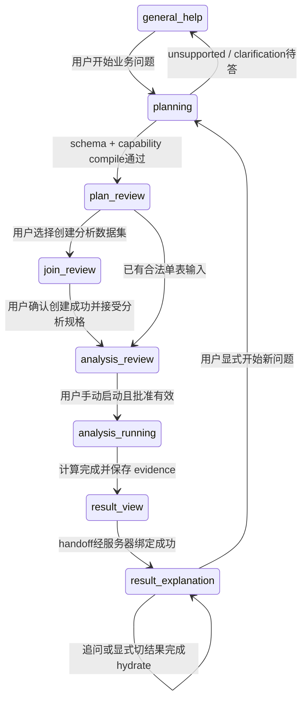

# P0D-H0 — Contracts and Context Architecture

## H1 用户批准修订（2026-09-07，优先于下文历史提案）

H0 总体方向已批准；本次仅批准 H1 实施。下文 CURRENT/OBSERVED 是 H0 审计时点事实，PROPOSED 仍不是实现声明；H1 当前实现另记于 P0D_H1_CAPABILITY_EXECUTION_IMPLEMENTATION.md。

- **D03 APPROVED**：baseline-rate 固定公式；mix=-2.56pp、within=-2.64pp，两者接近，within 绝对值略大，流量结构仍是重要因素。禁止无指标的唯一主因。每项排名必须含 ranking_metric、ranking_universe、direction、coverage；区分 channel_cvr_delta、conversion_count_delta、within_effect_pp、mix_effect_pp。保留原始 generator/真值历史，不改公式迎合叙事。
- **D04 APPROVED WITH MODIFICATION**：conversion_decline_diagnosis@1 必需 cohort CVR、channel CVR、mix/within；funnel 为 conditional optional。缺事件证据允许 core 成功且 optional coverage 不完整，不能发布 checkout/payment/funnel claim。明确要求漏斗环节时，funnel evidence 升为该问题必需；H1 未实现则 unsupported。漏斗不再是 H1 blocker；旧 Gate 2 FAIL 不自动变 PASS。
- **D07 APPROVED WITH MODIFICATION (H4)**：Verified Claims + Bounded Narrative。Claim AST 与 deterministic grounding 校验事实；模型可调整顺序、组织语言、综合已验证 findings。Narrative 不得新增 metric、number、entity、ranking、causal statement 或 unsupported recommendation。H1 不实现解释、Claim AST 或 narrative。


日期：2026-09-07。**PROPOSED：全文为设计合同与示例，不是已实现 API、schema 或执行器。** CURRENT/OBSERVED 的详细来源见[现状审查](P0D_H0_AGENT_ARCHITECTURE_REVIEW.md)。本轮不运行示例，不新增算子。

设计目标：InsightEase 知道能够计算什么、实际计算了什么、证据支持什么、模型可以发布什么，以及何时必须停止回答。所有 mutation 继续由用户显式授权，源数据 mutation 不向 Agent 开放。

## 1. 合同总览

| Contract | Owner | 输入 → 输出 | 强制不变量 |
|---|---|---|---|
| Capability | InsightEase 静态注册表 | 业务目标 → 实现能力定义 | 没有 operator/version/output contract 的能力不得 enabled |
| Tool | InsightEase 后端 dispatcher | typed action → typed artifact/reference | 工具副作用、权限、批准、预算独立检查 |
| Planning | 后端 compiler | LLM candidate + registry + metadata → reviewed proposal | 字段合法且目标 evidence 被输出覆盖 |
| Execution | 固定 deterministic operator | frozen spec + approved input versions → immutable result | 不接受自由代码/SQL/未注册表达式 |
| Evidence | 服务端 output adapter | result + provenance → EvidencePack | 数值、单位、population、support scope 不可分割 |
| Context | 服务端 selector | mode + artifact refs → bounded manifest/payload | 不跨租户/会话，不嵌入 raw rows |
| State/Routing | 服务端 session record | 显式事件 + expected version → 新状态 | 原子切换；stale response 不落入新状态 |
| Explanation | provider candidate | 当前 evidence → Claim AST | 不允许将自由文本当 verified answer |
| Verification | deterministic verifier | candidate + evidence + policies → publishable/abstain/reject | 模型提供的 grounding_status 不可信 |
| Reliability | 单一调用协调器 | deadline/error class → success/retry/fallback | 有界次数；不重复 state-changing execution |
| Audit | 应用审计存储 | manifest/decision/version → replay bundle | 不记录密钥、原始敏感行、隐藏思维链 |

### 1.1 通用类型约定

所有对象采用显式 schema_version；未知字段拒绝，枚举无默认兜底；数值必须 finite。ID 是不透明字符串，服务端生成且在 tenant/user 下解析；ID 存在不等于调用者有权读取。引用统一 `ArtifactRef = {kind, id, version, content_hash}`；version 为单调 revision 或不可变版本 ID。hash 依据固定 canonical serialization 计算；不把时间戳当内容版本。

字段名称、display_name、用户问题和上传 metadata 均为数据，不能升级为 L0 指令。下面 YAML 是供 H1 细化成 JSON Schema/Pydantic 的机器可读合同样例；不是直接可调用的生产接口。类型表和约束构成设计要求，不宣称示例已经通过 schema tests。

## 2. Capability Registry

### 2.1 字段合同

| 字段 | 类型 / 规则 |
|---|---|
| capability_id, version, display_name | 稳定业务 ID、语义版本、显示名；版本改变须保留旧 replay 定义 |
| lifecycle | proposed / enabled / deprecated；只有 enabled 可执行 |
| supported_question_types / supported_business_goals | 注册的有限 ID 集；不是自然语言营销标签 |
| required_field_roles / optional_field_roles | role、dtype、semantic_type、nullable、unique、value_domain、所属 grain |
| required_grain / accepted_grains | entity keys、row semantics、允许的显式转换；不能仅写字符串“表” |
| join_requirements | 是否需要、允许关系/连接类型、fanout 策略与源覆盖 |
| deterministic_operator / analysis_type | 固定 operator@version 与 UI 类型映射；不能由 LLM 指定函数路径 |
| supported_metrics / supported_dimensions | 注册 metric IDs、允许分组 role，精确定义/分母 |
| output_contract | Result@version、EvidencePack@version，必需与条件 evidence |
| supported_claims / unsupported_claims | Claim type 与 predicates；显式禁止因果/完整旅程等 |
| evidence_semantics | 字段与 evidence type 的固定映射，范围约束 |
| known_limitations / assumptions | 可机器判断的要求 + 用户可读说明 |
| required_confirmation | 持久化结果/派生 dataset 必须确认；不赋权 provider |
| expected_cost / expected_latency | 量级、输入范围、估算来源；未 benchmark 必须标 estimated |

### 2.2 旗舰能力样例

```yaml
schema_version: capability.v1
capability_id: conversion_decline_diagnosis
version: 1.0.0
display_name: 新客转化跨期诊断
lifecycle: proposed
supported_question_types: [conversion_change, segment_change, descriptive_driver]
supported_business_goals: [compare_new_customer_cvr, locate_accounting_contributors]
required_field_roles:
  - {role: entity_id, dtype: string, nullable: false, semantics: registered_user}
  - {role: conversion_flag, dtype: boolean_or_binary, nullable: false, semantics: user_conversion}
  - {role: cohort, dtype: category, nullable: false, semantics: registration_cohort}
  - {role: acquisition_channel, dtype: category, nullable: false, semantics: acquisition_channel}
optional_field_roles:
  - {role: paid_first_order, semantics: paid_first_order_per_user, purpose: cross_check}
  - {role: event_name, semantics: observed_behavior_event, purpose: funnel_comparison}
  - {role: event_time, semantics: occurrence_time, purpose: funnel_comparison}
required_grain: {entity: user, keys: [entity_id], rows_per_key: 1}
accepted_grains:
  - {kind: user, conversion: identity}
  - {kind: user_order_detail, conversion: validated_user_projection_v1}
join_requirements:
  mode: conditional_on_selected_input
  allowed_types: [left]
  relationship: server_confirmed_version_required
  fanout_policy: reject_inconsistent_user_attributes_then_project_unique_user
deterministic_operator: conversion_decline_recipe@1.0.0
analysis_type: conversion_decline_diagnosis
supported_metrics: [new_customer_count, converted_customer_count, new_customer_cvr, cvr_delta_pp, mix_effect_pp, within_effect_pp]
supported_dimensions: [cohort, acquisition_channel]
output_contract:
  result: ConversionDiagnosisResult@1
  evidence: EvidencePack@1
  required: [cohort_cvr_comparison, channel_cvr_comparison, mix_within_decomposition]
  conditional: [first_order_consistency, cohort_channel_funnel_comparison]
supported_claims: [observation, comparison, accounting_decomposition, diagnostic_next_step]
unsupported_claims: [causal_ad_effect, budget_optimization, complete_journey, guaranteed_conversion_lift]
evidence_semantics:
  attribution_kind: descriptive_accounting_not_causal
  rate_unit: fraction
  difference_unit: percentage_point
known_limitations: [observational_data, only_two_selected_cohorts, no_unregistered_dimensions]
assumptions: [same_conversion_window, disjoint_cohorts, comparable_tracking]
required_confirmation: {create_derived_dataset: true, persist_analysis: true, source_mutation: prohibited}
expected_cost: {class: medium, scan: linear_in_input_rows, basis: design_estimate_not_benchmark}
expected_latency: {class: seconds_to_tens_of_seconds, basis: requires_measurement, excludes_provider: true}
```

`analysis_type` 为拟新增类型，当前不存在；启用前必须落实 executor、UI 映射、tests、output adapter。能力目录不能因为描述完成就提前 enabled。

### 2.3 固定 recipe 与计算定义

1. 验证注册 cohort：必须显式选择 `previous_month` 与 `recent_month`；不将 Gate 1 的 `current_month` 字符串静默映射为真实枚举。用户确认的同义口径需记录 resolved_value。
2. 将 user_order_detail 投影为 user：每个 user_id 的 conversion/cohort/channel 必须一致；冲突则 data_invalid，不能用 first()/last()/max() 偷选。分母以 users 完整人群为准；INNER Join 丢用户的输入不能冒充完整人群。
3. 核对 conversion_flag 为 0/1、缺失 policy 明确；保持 registered users 包括未下单用户。订单 cross-check 先按 user_id 计算“存在 paid 首单”，不能 count(order rows) 代替 count(user)。差异生成 evidence/quality flag，不静默覆盖主指标。
4. cohort 和 channel 的用户数、转化数、率全部由 deterministic operator 计算。分母为零时 value=null + reason=zero_denominator，不能输出0%。未知渠道保留 unknown 类别或要求澄清，不能静默删除分母。
5. 固定分解（沿用 demo 生成器定义）：令两期渠道份额为 w0,w1、渠道 CVR 为 r0,r1：

   `delta = Σ(w1*r1 - w0*r0)`；`mix = Σ((w1-w0)*r0)`；`within = Σ(w1*(r1-r0))`；`delta = mix + within`。

   operator 生成 unrounded values 和统一的 pp 显示值；verifier 校验恒等式。该分解非因果、路径依赖，不能悄悄切换 midpoint/Shapley 后仍称同一指标。新出现/消失渠道导致某期 r 未定义时，V1 返回 decomposition_unavailable，同时保留可算的 cohort 比较；未来再设计 enter/exit decomposition，不能补零伪造。
6. 排名须带 ranking_metric、universe、direction、ties。social share 从15%→40%且低于基期总体 CVR，可支持“流量结构向低 CVR 渠道移动”；不能把它与未中心化 mix 分项的符号混淆。分解绝对贡献排名与该结构性描述分开展示。
7. Funnel 分支只读批准的事件/cohort/channel 输入，用唯一用户、事件有序、明确观察窗口分别计算 stage population 与 transition denominator。不以 Join 后行序或订单数代替行为事件。现有 funnel 函数可作为候选复用点，但须先审计严格顺序/窗口语义，不能因为函数存在就宣称与该合同一致。
8. 每个分支输出 coverage：not_requested / missing_input / blocked / computed。core 成功不允许无 funnel evidence 的 checkout claim。保持完整原 Gate 2 时，funnel 缺失应使 business acceptance 失败，不能把正常 abstention 当完整问题已回答。

## 3. Execution 与 Planning Contract

### 3.1 为当前 attribution 建立诚实的 execution 描述

此处是 **PROPOSED 的注册包装**，描述 CURRENT 计算，新增语义 gate 尚未实施。

```yaml
schema_version: execution-contract.v1
operator_id: touchpoint_attribution
operator_version: legacy-adapter-1
input:
  dataset: OwnedDatasetRef
  required_roles: [user_id, represented_touchpoint, sortable_timestamp]
  params: {models: allowed_model_ids, conversion_flag: optional_column, conversion_value: optional_column}
  represented_grain: input_record_per_user
  business_preconditions:
    - real_conversion_claim_requires_explicit_valid_conversion_flag
    - behavioral_claim_requires_event_grain_and_tracking_coverage
output:
  contract: TouchpointAllocationResult@1
  grain: [model, represented_touchpoint_label]
  metrics: [allocated_conversion_value, share_of_allocated_value, represented_user_count, represented_record_mean]
  comparison: none
supported_claims:
  - {predicate: allocation_share, scope: represented_records_and_selected_model}
  - {predicate: aggregate_rate, requires: explicit_conversion_flag_and_population}
unsupported_claims:
  - cohort_cvr_decline
  - traffic_mix_decomposition
  - causal_channel_effect
  - complete_behavioral_journey
  - funnel_priority_from_record_mean
quality_rules:
  - missing_conversion_flag_means_assumed_conversion_not_observed_conversion
  - registration_channel_repeated_by_orders_is_not_behavioral_touchpoint
```

### 3.2 Plan 的两次验证

| 阶段 | 输入 | 输出 |
|---|---|---|
| Candidate validation | LLM 的 TypedPlan + manifest | schema/references/allowlist 合法的 proposal |
| Compile / preflight | proposal + registry + authoritative metadata/versions | 可执行规格或 clarification / unsupported / stale |

Plan v2 最少字段：`plan_id/version, question, business_goal_ids, capability_ref, input_refs, field_bindings, population_spec, comparison_spec, required_evidence_types, optional_evidence_types, expected_output_contract, limitations, assumptions, confirmation_steps, context_version, status`。`field_bindings` 是 source_dataset/version/column_id→role，避免重名列歧义。`metrics` 只取 registry，不容模型写 formula。主表、分子分母、周期与 channel 通过 capability 约束，不由一个 recommended_analysis_type 推断。

Compile 的不变量：required goals ⊆ capability goal set；required evidence ⊆ recipe guaranteed/已满足条件的 output set；所有字段类型与 grain 接口匹配；参照关系批准版本有效；预算可接纳。只要任一必需目标不覆盖，就不能标 executable=true。用户可审阅一个“缩小问题后的新计划”，但系统不能自行减掉问题。

ExecutionSpec 冻结 `capability_ref/operator_ref, input_refs, field_bindings, population/comparison, output_contract, approved_plan_hash, approval_ref, idempotency_key, request_id`。返回 `AnalysisRun {status, computation_status, coverage_status, result_ref, evidence_pack_ref, warnings, timings}`。`completed` 只代表计算任务完成；业务 answer coverage 单独记录。重跑生成新 result version，不覆盖旧 evidence。

## 4. Tool Registry 与批准边界

### 4.1 Tool schema

```yaml
schema_version: tool.v1
tool_id: join.create_dataset
capability_id: dataset_join
purpose: Persist exactly one reviewed derived dataset
input_schema: CreateReviewedJoin@1
output_schema: DerivedDatasetRef@1
access: write_derived
side_effects: [create_file, create_dataset_metadata]
confirmation_requirement: user_bound_approval
allowed_artifacts: [owned_dataset_version, confirmed_relationship_version, reviewed_join_plan]
preconditions: [ownership_valid, approval_hash_matches, preview_versions_current, risk_not_blocked, high_risk_ack_if_needed]
postconditions: [sources_unchanged, lineage_saved, at_most_one_result_per_idempotency_key]
failure_modes: [stale_preview, permission_denied, risk_blocked, storage_error, commit_error]
audit_events: [approval_consumed, join_started, derived_created, compensation_recorded]
provider_callable: false
```

### 4.2 V1 工具最小集合

| tool_id | 权限/副作用 | 谁可发起 | 前置/后置条件 |
|---|---|---|---|
| metadata.describe | 只读受控 metadata | 应用 selector；未来可限额开放 provider | owned/versioned；不返回样例敏感值 |
| capability.describe | 只读 registry | selector | enabled definitions、契约版本 |
| evidence.read | 只读已生成 evidence | 应用；V1 provider 不直接调用 | 请求 ID 属于当前包、scope/budget；不得 arbitrary file/path |
| plan.propose | provider 生成，无业务 mutation | 用户提问 | 有界 context；返回 proposal，不能自动执行 |
| join.preview | 只读但有计算成本 | 用户进入预览或批准的应用流程 | 保留 P0C 风险/行数限制；无 Dataset 持久化 |
| relationship.confirm | 元数据状态写入 | 用户 | 确认精确 edge+versions；返回批准关系 revision |
| join.create_dataset | 新增 derived artifact | 用户 | 精确 preview/plan/source hash；幂等；源不变 |
| analysis.run | 持久化分析结果 | 用户手动点击 | frozen ExecutionSpec 与 run approval；结果可追溯 |
| explanation.generate | provider 调用与审计 artifact | 用户结果追问 | 当前 evidence hydrated；不重新分析 |
| source.mutate / sql.execute / code.execute | 禁止 | 无 | 不注册；模型输出也不能被路由到这些接口 |

批准记录：`approval_id, user_id, action, artifact_refs, plan_hash, preview_hash, risk_ack, created_at, expires_at, consumed_by`，建议15分钟有效、版本变化立即失效。由认证用户操作创建，LLM 请求 schema 不含审批字段；成功消费后同 idempotency key 只返回原结果，不能多写。不同参数复用 key 返回 conflict。DB/文件跨存储失败保留 pending/compensation 记录，不把部分落盘当成功。

批准只是“用户同意做这项操作”，不是“数据和结论正确”的证明。V1 不需要复杂审批平台；同一后端的 approval record +事务约束足够。必须审查旧 analysis API 不能绕过 Agent 保护：保持现有人工 API 的认证行为，同时新 Agent adapter 只接受受约束 action，且不能持有直接调用旧写接口的通用凭据。

## 5. Typed Evidence Contract

### 5.1 EvidencePack 与 metric 字段

`EvidencePack@1`：`pack_id/version, schema_version, tenant_scope, source_analysis_ref, capability_ref, input_refs, context_version, produced_at, evidence[], coverage, omissions[], content_hash`。正常包建议最多32条完整 evidence、最多20个 segment/rank 成员；超限按任务选子集并标 `coverage=partial`，不得仍宣称全渠道最大。V1 demo 的5渠道×2期应完整保留。

| Evidence 字段 | 类型与含义 |
|---|---|
| evidence_id / type | 不可变 ID；metric / comparison / ranking / decomposition / funnel_transition / quality_check |
| metric_id / label | 注册指标与本地化标签；label 不承担语义验证 |
| value / unit | finite number 或明确 null reason；fraction/percentage_point/count/currency 等分开 |
| definition / formula / derivation_method | registry ref + version；后端填，模型不能覆盖 |
| grain | 实体、keys、表示的行语义 |
| population | cohort/filter/window/entity key 的结构定义与版本；不是模糊“用户” |
| numerator / denominator | metric/count ref + value +单位 +纳入规则；非比率用 null/not_applicable |
| comparison_population | baseline/current 两个人群 spec；须可比，不能静默换口径 |
| baseline / current / delta | 原值、显示值、单位、period ref；delta_pp 由算子提供 |
| dimensions | dimension_id 与实际枚举值；不得自由创造 channel |
| source_dataset_ids / source_analysis_id | 可导航 ID，但必须搭配版本引用 |
| provenance | operator version、input hashes、参数 hash、lineage/grain transformation、质量检查 |
| support_scope / cannot_support | 有限 Claim predicates、适用 population/时间、禁用语义标签 |
| confidence | computation_exactness、coverage、statistical_method/interval（可 null）；不把 LLM high 当统计置信度 |
| sample_size | 各 population 的样本量，必要时 min cell；不可只给总 N |
| quality_flags | 缺失、选择偏差、fanout、追踪覆盖未知、口径冲突等 |

### 5.2 真实 demo 数值的设计示例

下例数值来自已有 Q03；它演示未来 evidence 应怎样表示，**不是声称当前服务已经输出该对象**。

```yaml
evidence_id: ev_demo_cvr_comparison_v1
type: comparison
metric_id: new_customer_cvr
label: 新客转化率跨期比较
value: -5.2
unit: percentage_point
definition: metrics.new_customer_cvr@1
grain: {entity: user, keys: [user_id], row_semantics: unique_registered_user}
population: {new_user_only: true, conversion_source: users.converted, cohort_basis: registration}
numerator: {metric_id: converted_customer_count, baseline: 240, current: 188, unit: count}
denominator: {metric_id: new_customer_count, baseline: 1000, current: 1000, unit: count}
comparison_population:
  baseline: {cohort: previous_month, start: '2026-07-01', end_exclusive: '2026-08-01'}
  current: {cohort: recent_month, start: '2026-08-01', end_exclusive: '2026-09-01'}
baseline: {value: 0.240, unit: fraction, display_value: '24.0%'}
current: {value: 0.188, unit: fraction, display_value: '18.8%'}
delta: {value: -5.2, unit: percentage_point, display_value: '-5.2pp'}
formula: metrics.cvr_delta_pp@1
derivation_method: unique_user_cohort_counts@1
dimensions: [cohort]
source_dataset_ids: [users_demo]
source_analysis_id: example_future_diagnosis_run
provenance:
  input_refs: [{kind: dataset, id: users_demo, version: immutable_upload_version, content_hash: required_at_runtime}]
  operator_ref: conversion_decline_recipe@1.0.0
  parameters_hash: required_at_runtime
support_scope:
  predicates: [population_rate, period_rate_difference]
  scope: these_two_observed_registration_cohorts
cannot_support: [causal_ad_effect, acquisition_budget_cut, complete_customer_journey]
confidence: {computation_exactness: exact_counts, coverage: observed_dataset, statistical_method: null}
sample_size: {baseline: 1000, current: 1000}
quality_flags: [observational_not_causal]
```

运行时 schema 不允许 `required_at_runtime` 之类占位值；示例以此表明 provenance 必须由实际存储生成。

ranking evidence 保留 `rank, entity_ref, metric_ref, value, unit, ties`；带 `ranking_universe, included_count, total_count, order, omitted_count`。模型只能说“展示集合中最高”还是“全部渠道最高”，取决于 universe coverage；Top3 不代表其余渠道为0。

decomposition evidence 存 baseline_formula_version、total_delta、mix/within、各分项、reconciliation residual、ranking_metric。funnel evidence 存 cohort/channel、from_stage、to_stage、eligible_users、transitioned_users、ordered/window semantics、追踪覆盖与 rate 对比。

### 5.3 True Metric / Unsupported Claim

```yaml
evidence_id: ev_represented_records_mean
type: metric
metric_id: represented_record_mean
value: 1.03
unit: records_per_user
definition: rounded_mean_count_of_joined_input_rows_per_user
grain: {entity: user, represented_rows: user_order_left_join}
provenance: {raw_ratio_description: '2054 input records / 2000 represented users', displayed_precision: 2}
support_scope:
  predicates: [represented_record_mean]
  scope: this_joined_dataset_only
cannot_support: [complete_journey, first_touch_conversion_dominance, funnel_bottleneck, causal_acquisition_priority]
quality_flags: [join_fanout, registration_channel_repeated, behavioral_coverage_unknown]
```

这类限制应由 operator/lineage 决定，不能要求模型自觉读 warning 后遵守。`cannot_support` 是拒绝条件，`support_scope` 是允许条件；没有允许的谓词即拒绝，不能靠“禁用列表没写到”放行。

## 6. Claim taxonomy、Explanation 与 verifier

### 6.1 控制粒度

V1 只需有限词表，不做通用知识图谱：

| Claim type | 最低证据 | 可发布内容 | 不允许升级为 |
|---|---|---|---|
| observation | 当前 exact metric + population | 此样本的计数、率 | 趋势、因果 |
| comparison | 可比双期 evidence | 差值、方向、限定排名 | 干预效果 |
| interpretation | 注册 decomposition/association predicate | 按指定公式的会计贡献 | 真实世界因果机制 |
| recommendation.diagnostic | 观察/质量缺口 + 允许动作 | 核查数据、补比较、检查支付流程 | 自动预算调整、保证收益 |
| recommendation.intervention | 实验/目标/成本约束/风险证据 | V1 不开放自动发布 | 仅凭 CVR 就砍渠道 |
| causal | 注册因果能力与识别假设证据 | 当前 V1 能力不支持，正式不足 | 相关性直接因果 |

diagnostic priority 也需要 ranking/comparison/coverage evidence；没有完整 funnel 不能说“首触最值得优化”。有 checkout transition decline 时可说“优先检查该观测到恶化的环节”，不能保证修复后提升多少。

### 6.2 结构化解释样例

```yaml
schema_version: explanation-candidate.v1
evidence_pack_ref: {id: pack_example, version: 1, content_hash: required_at_runtime}
context_version: 8
executive_summary: {finding_refs: [finding_1]}
findings:
  - finding_id: finding_1
    claim:
      type: comparison
      predicate: period_rate_difference
      subject_metric_id: new_customer_cvr
      evidence_value_bindings: {baseline: baseline, current: current, change: delta}
      template_id: cvr_period_change
    importance: high
    evidence_refs: [ev_demo_cvr_comparison_v1]
    confidence: {level: descriptive, basis: observed_complete_input}
limitations:
  - {code: observational_not_causal, evidence_refs: [ev_demo_cvr_comparison_v1]}
recommended_actions:
  - action_id: inspect_tracking_coverage
    type: diagnostic_next_step
    evidence_refs: [ev_demo_cvr_comparison_v1]
    prerequisite: comparable_tracking_verified
    effect: no_execution
insufficient_evidence: false
unsupported_questions: []
```

每个 finding 至少一个 evidence_ref；模型不能填 `grounding_status=verified`。只有验证后的 `ValidatedExplanation` 增加 `grounding_status, validation_report_ref, rendered_text, provider_source, fallback_used`。executive_summary 引用已验证 finding，不另开自由文本通道。recommendation 使用白名单 action_id，应用从 evidence 生成可读说明。禁止 unrestricted HTML、任意 URL/action target。

允许 LLM 做真实 synthesis：选择相关 finding、排序、选择受支持的比较和限制、提出白名单调查动作。**按批准的 D07：Verified Claims + Bounded Narrative**。事实经 Claim AST 与 deterministic grounding；允许模型组织已验证 findings 的语言与顺序，但不能新增指标、数字、实体、排名、因果或无支持建议。具体实现留 H4。

### 6.3 后端验证流水线

1. 校验 JSON envelope /严格 schema；可支持一个定义明确的 fence 去包装，但包内必须仍是有效 JSON；不修复非法引号，不把解析失败文本变 answer。
2. 按认证上下文加载服务器 evidence pack，校验 owner、hash、version、analysis completion；不相信浏览器随请求提交的数值。
3. 对每个 claim 查 evidence_ref/metric/entity/dimension 在当前 pack 与 registry 内；禁止外包引用。
4. Claim predicate 必须在各 evidence 的 support_scope；population、窗口、粒度、predicate 输入接口兼容；命中 cannot_support 即拒绝。
5. 数值只允许引用绑定；若 candidate 携带 literal（迁移适配），单位及规范值精确匹配。原计算高精度容差如1e-10用于恒等式；显示值使用 registry rounding，不能用大容差放行1个百分点误差。
6. comparison/ranking 必须有对应 evidence type 与完整比较空间。recommendation 验证动作类别和所需证据，causal V1 一律不支持。
7. 对模型残留自由文本中的因果措辞/数值做检测只能作辅助；**关键词扫描不是语义证明**。主保证来自有限 Claim AST 与服务端模板。
8. 生成 verified findings 与结构化不足；任何未通过的高影响 finding 不发布，相关 executive summary/action 一并失效。记录 rejection code，不让 provider 自评覆盖。

### 6.4 Abstention 是成功状态

```yaml
status: completed
answer_status: insufficient_evidence
reason: missing_cohort_channel_comparison
supported_findings: [existing_verified_aggregate_observation]
missing_evidence: [cohort_channel_cvr, population_denominators]
missing_capability: [conversion_decline_diagnosis]
recommended_next_step: review_supported_analysis_plan
unsupported_questions: [which_channel_caused_the_decline]
```

区别：insufficient_evidence 是系统正确判断证据不足；provider_unavailable / generation_invalid 是技术失败；data_invalid 是输入不满足。三者不能都显示“网络错误”，也不能都计为成功回答。对“social ads 导致用户质量变差？”可先发布 social CVR 下降的 observation，再说明不能推断原因及缺少实验/混杂控制、质量指标等证据。

## 7. Context Loading / Unloading Architecture

### 7.1 生命周期与权威来源

| 范围 | 保存什么 | 装载时机 | 卸载/失效 | 何时 hydrate |
|---|---|---|---|---|
| persistent | registry versions、dataset/relationship/result refs、批准与审计 | 每次授权引用 | 撤权立即阻断；旧版本可审计保留 | 每次依赖版本变化/首次使用 |
| session | conversation_id、mode、active refs、口径决议、context_version | 打开会话/刷新 | 新会话不继承 active refs；关闭清内存但保留服务器会话 | 从服务端恢复，不以 localStorage 为权威 |
| active artifact | 当前 plan/join/run/result 的最小合同与证据 | 用户明确切换 artifact | 替换时卸载旧值、取消旧请求；旧结果只可显式 compare | 按 ID+version 校验 owner/hash/status 后读取 |
| task | 本次 question、required goals、allowed evidence/capability subset | 请求开始 | 完成/取消/deadline 后释放 | 同版本重试复用冻结任务，不混入新上下文 |
| provider prompt | 本次选择的 L0–L7 内容 | admission/budget 通过后 | provider 调用结束即清理；不可默认延续 Gateway memory | 每次由 manifest 重建；不用整个聊天记录复原 |

ID 引用不是让模型凭空检索：应用先 hydrate 必需合同/证据再送入；被省略的 artifact 只能看到身份与 availability，不能据其未展开内容下结论。V1 不默认开放 provider retrieval tools。

### 7.2 L0–L7 层

| 层 | 内容 | planning | result_explanation | 权威/优先级 |
|---|---|---|---|---|
| L0 | 系统边界、输出合同、允许 action/claim | 必需 | 必需 | server policy，最高，不可被数据替代 |
| L1 | capability 目录与当前允许 output/claim | 选中小目录 | 只要当前 capability 语义 | registry version，必需 |
| L2 | 字段角色/数据与关系版本、质量摘要 | 问题相关数据子集 | 仅 population/lineage 所需 metadata | backend authoritative；不传原始样例 |
| L3 | 当前计划与口径决定 | 修订计划时必要 | 只取已验证口径/目标，不把旧计划猜想当证据 | active plan version |
| L4 | 执行规格、状态、coverage | 通常只引用 | 结果条件/方法及失败分支摘要 | execution record；running 不能充当结果 |
| L5 | evidence pack 与 support scope | 默认不附；显式从结果重规划才选 | 必需、优先完整支持单元 | server generated immutable evidence |
| L6 | 近期用户对话和已确认口径摘要 | 2–4轮有界文本 | 2–4轮有界，旧模型文字不当证据 | user text untrusted；系统提取决议需来源 |
| L7 | optional references / Skill 提示 | 显式相关才加载 | 仅解释有需要且已授权 | 最低；不能扩大 capability/permission |

禁止默认将八层全量拼接。上传文档中的“忽略限制/执行 SQL”仍为内容，不是指令；引用材料、历史模型回复与 authoritative evidence 在 manifest 的 trust 字段中区别。

### 7.3 Selector / Budget / Manifest

ContextSelector 为纯选择逻辑，输入 `mode, task_goals, active_refs, permissions, budget_policy`，输出 `manifest + selected_context`。顺序：授权→freshness→必需证据依赖闭包→优先级→token estimate→admission。不能先裁剪再发现某个 finding 少了分母。

```yaml
schema_version: context-manifest.v1
conversation_id: conversation_example
context_version: 8
mode: result_explanation
task_id: question_3
active_result_ref: {kind: result, id: result_example, version: 1, content_hash: required_at_runtime}
selector_version: selector@1
budget_policy: provider_budget@1
entries:
  - {layer: L0, ref: policy@1, priority: required, trust: application_policy, representation: full_contract}
  - {layer: L5, ref: evidence_pack@1, priority: required, trust: deterministic_evidence, representation: selected_complete_evidence}
excluded:
  - {layer: L7, reason: unrelated_reference}
freshness: valid
estimated_application_tokens: 6000
gateway_overhead_estimate: separately_measured_required
manifest_hash: required_at_runtime
```

**PROPOSED 初始预算，需 H5 实测校准，不是 DeepSeek 模型规格**：应用 context hard cap 8,000 tokens；planning 建议分配 L0/schema2,000、L1 1,500、L2 2,800、L3/任务1,000、L6 700；解释优先 evidence，L0/claim/schema2,000、L1/L3/L4 1,000、L5 4,000、L6/L7合计1,000。是上限分配，不要求填满。

真实端到端输入建议初始 cap 24,000，预留输出12,000，总 budget 36,000，且不得超过 adapter 验证的有效上下文容量。较大输出保留来自 Gate 1 约9.8k completion 的既有观测；这不是期望常态，应压缩计划格式后再下调。provider payload 需要可验证的 output cap；现有请求没有该上限。

Hermes 会加额外 system/skills context；InsightEase 只能硬限制自己构造的输入，**若 Gateway 不提供可计量/限制的 overhead，就不能宣称端到端 hard cap 已被强制执行**。H5 应固定 Gateway runtime profile、禁止隐式 memory/不相关 skills、记录实际 usage，验证余量。暂时不可计量时声明 estimated budget，超限 fail closed 或本地不足，不能假报 token guarantee。

裁剪顺序：L7无关引用→历史模型 prose→旧计划→重复 metadata→次要可选 evidence。保留单位/分母/来源/support scope作为一个不可拆单元。必需 context 仍超限时分小问题或澄清，不直接截断 JSON，不把不完整排名说成全集排名。缓存按 user+artifact version+selector version，不能只按 dataset_id。

### 7.4 Freshness、版本与并发

dataset version 至少绑定内容 hash+schema version；relationship version 绑定 edge 集和确认；plan version 绑定 capability/input refs；result version 绑定 execution spec+输出；context_version 在 mode 或 active refs/口径更改时递增。

- 请求带 expected_context_version；结果回包带 captured_context_version + task_id。切结果/会话后旧响应只能记历史 trace，不能写进新对话或替换当前 answer。
- dataset 删除、撤权、版本变化：标 stale、停用 execution approval；hydrate后重新验证，再让用户审阅。不能用 TTL 代替版本校验。
- 旧 immutable result 可以继续解释“当时版本”，只要用户显式选择且仍有权限；有新结果不自动宣告旧结果无效。当前选择被新 run 替换才切 active pointer。
- Refresh：从服务端恢复 mode/ref/version，hydrate current evidence；加载完成前 disabled解释，不在短暂无结果时自动落 planning。
- 同一用户多页通过 optimistic CAS 更新；冲突返回409并重新加载。不把后到请求视为更新的一方。
- 新 conversation 默认空 artifact；继承数据/关系只能显式选择。退出账号清本地 cache；服务端始终按 identity授权，不能依赖前端清空完成安全隔离。
- Metadata cache 建议5分钟，health30秒，handoff command建议5分钟，approval15分钟；这些 TTL 只控制重查/可用性，artifact/replay retention 独立。

### 7.5 可复用 Context Architecture Candidates

| 抽象 | 稳定接口候选 | InsightEase 专属部分 | 未来 Skill integration |
|---|---|---|---|
| ArtifactContext | ref/version/hash/owner/freshness | dataset、relationship、analysis resolver | Skill 只能注册 resolver adapter，不能扩大权限 |
| ContextSelector | task+mode+budget→manifest | capability/evidence依赖图 | 可对比通用 Skill 的注意力选择规则 |
| EvidencePack | typed claims/input provenance/coverage | CVR/funnel 指标词表 | 共用 envelope，领域 schema 独立版本 |
| ContextBudget | estimate/admit/evict | Gateway overhead profile | runtime adapter 提供实际 usage，不由 Skill 猜 token |
| Priority/TTL | required/optional、expires_at | 业务审阅/数据更新策略 | 可复用策略引擎，不共享用户数据 |
| AttentionHint | 需要关注的 evidence IDs/缺口 | diagnosis目标 | 仅影响选择顺序，不覆盖 cannot_support |
| ContextLoader | authorize/hydrate/unload | DB/文件访问 | 宿主控制权限；Skill 不持原始凭据 |

通用归因 Skill 尚未成为依赖；本轮不读取/修改另一个项目，也不假设其完成。未来集成先比 envelope/version/预算测试和卸载行为，避免先建设通用插件框架再等待业务需求。

## 8. Explicit State / Routing

### 8.1 状态拥有者与最小模型

服务端 session record 为 source of truth，前端为展示和命令发起者；无需在 V1 引入完整 event-sourcing 平台。

`SessionState {conversation_id, context_version, conversation_mode, active_dataset_ref, active_relationship_set_ref, active_plan_ref, active_join_plan_ref, active_analysis_ref, active_result_ref, pending_task_id, hydration_status, updated_at}`。

mode：general_help / planning / plan_review / join_review / analysis_review / analysis_running / result_view / result_explanation。artifact 缺失/过期是 hydration/status 问题，不静默换mode。



join preview刷新不创建dataset，risk blocked停留join_review；execution失败回analysis_review并保留错误run；insufficient_evidence留result_explanation。因上下文stale暂停的任务需hydrate/重审，而非隐式rerun。模式切换需要 audit action，不接受 LLM 的 `set_mode` tool call。

### 8.2 Routing priority 的限定

1. **显式应用命令**（开始新问题、切结果、确认运行）先经身份与状态机处理；自然语言明确请求新任务可呈现该命令供用户选择。
2. 已确认 conversation_mode 与 active artifact/version 决定本条普通消息的 handler。
3. 在该 handler 内理解用户问题、分类 explain/risks/next steps。
4. 无 active task 的 general_help 才用 classifier/heuristic 提议 mode；不能授权 execution。

这保留“应用状态 > 关键词”，同时不把用户困在旧结果里。用户明确切换意图高于旧状态，但必须先形成合法 state transition；不能用“建议”二字就重解释，也不能用“原因”二字就重新规划。

handoff：用户点击→提交目标 result ref+expected context version→后端 ownership/version/status验证→原子绑定mode/result→ack context_version→前端显示成功→hydrate evidence ready。前端仅一个 active result指针，取消 attached vs selected history 双权威；本地缓存失败不能假装交接成功。

## 9. Reliability、Trace 与 Replay

### 9.1 初始 V1 reliability policy（待 H5 校准）

| 项目 | 设计 |
|---|---|
| Deadline | planning总150s、单次≤120s；explanation总90s、单次≤60s；health2s。前端deadline=后端总预算+10s，统一配置下发 |
| Retry | 总尝试最多2次，初次+至多1次；只读provider生成重试，且剩余预算足够。deadline耗尽不重试 |
| 可重试 | 暂态网络/429/502/503；Retry-After受总预算限制；短退避0.5–2s+jitter |
| 修复重试 | schema/引用错误可在同一冻结上下文内一次，给机器错误码和合法ID，不喂原始行；与网络重试共用2次上限 |
| 不可重试 | 401/403配置、ownership、stale、capability缺失、data_invalid、业务证据不足；不靠重试碰运气 |
| Scope violation | 一次严格拒绝，可用verified facts/abstention结束；不能无限重写直到verifier漏过 |
| Fallback | 明确provider_error/generation_invalid；规划仍必须通过同一capability compiler，解释只输出已验证事实模板/不足；不自动换模型 |
| Circuit breaker | 建议连续3次传输故障开60s，half-open一次；schema/grounding错误另计质量告警，不能混成网络故障 |
| Cancellation | task deadline+context version；丢弃late answer，不能重放到新会话；线程取消不等于远端调用已终止，记录orphan latency |
| Writes | 不跟provider retry重试；用户批准与idempotency单独管理，不因回答超时重建dataset/run |
| Transparency | 显示成功来源、延迟/重试、fallback reason、grounding和答案充分性；不显示密钥或完整内部prompt |

预算不是 SLA。Gate 1 的一次成功、人工重试成功和模型长延迟都不能外推成功率。记录时间窗和分母后再比较 schema-valid、semantic-valid、grounding-valid、timeout和fallback rates。V1.1才评估 router 的 cost/latency/grounding综合选择。

### 9.2 AgentTrace

一个 request trace 至少记录：request_id/conversation_id/user scope，mode/context_version，active artifact refs，capability/operator/schema/selector/policy versions，context manifest hash和纳入/排除原因，应用token estimate/Gateway actual usage，provider/model，attempt_no/latency/deadline/cancel，fallback reason，validation code（不含原始输入值），approval/execution事件，evidence IDs，claim→evidence→validation映射。

主日志不保存 credentials、auth headers、DB连接、原始行、完整result_data、文件路径、隐藏reasoning。上传metadata文本也可能敏感，按allowlist/脱敏策略处理，不能把“列名”默认当公共信息。

### 9.3 Replay artifact 与边界

`ReplayBundle@1 {request/question_redacted, registry_refs, context_manifest, frozen_plan, execution_spec_ref, input_versions, result_version, evidence_pack, provider_candidate_sanitized, validated_explanation, validation_report, policy_versions}`。

审计 replay 不依赖完整聊天，也不要求再调模型：使用被冻结的 candidate/evidence/validator version复验。确定性再计算需要仍保留的源版本及operator环境hash；没有源数据时只能复验解释，不能声称复算了计算。再次调用模型是新实验，不保证逐字复现。

provider output 可能泄露敏感数据：只在受控加密 artifact store 留已筛查文本、按用户可配置保留期限（建议30天起步）；如含敏感原文，仅存hash/error与脱敏样本，replay标 `limited`。不把完整provider输出无条件写stdout。问题同样脱敏，审计完整性与删除权/保留策略冲突需D11决策。V1用同一数据库+私有artifact存储，不建专门遥测平台。
