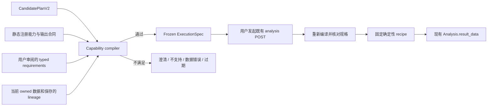

# P0D-H1 — Capability & Execution Implementation

## H1.1 状态更新 — 2026-09-07

**原 H1 worker PASS 已被独立 source audit 的 FAIL 推翻；H1 仍为 FIX REQUIRED，H2 BLOCKED。**
下方原 H1 实施与验证记录完整保留，属于历史时点；其中 CURRENT/PASS 和类型处理描述不能作为当前放行依据。
独立审计报告与决策登记原文不修改。

本轮 F01 修复已实现：`authoritative-input-fingerprint@1` 统一绑定执行实际依赖的主输入和 base
内容、schema 语义、字段绑定、粒度、JoinPlan/lineage、关系快照、投影和规范化策略。
非空 derived `transform_chain` 明确 unsupported。后台从 owned 数据重新生成 fingerprint，
状态不匹配在调用诊断 recipe 前拒绝；原两个 create → BackgroundTasks 反例均已加入回归。
display name、description、UI label、样例等明确非语义字段不参与 fingerprint。

F02 产品策略已定为 `conversion-normalization@1`：原生 bool、numeric 0/1，以及去首尾空白、
大小写不敏感的文本 true/false/1/0 可确定性映射；混合有效值允许，其他文本、空串、null、2/−1 拒绝。
CSV token / Excel 原始逻辑 cell 在 capability input adapter 规范化并记录 policy/version、
类型计数、logical hash 与 normalization_applied；不能依赖 pandas 的类型推断来宣称原始类型。
`conversion_diagnosis_service` 仍仅接收 canonical bool/0/1，原严格算子断言不放宽。
这项明确的 reader 边界策略取代原记录中对源文本一概拒绝的主张。

旧保存的 ExecutionSpec 缺少新必需 fingerprint 时被拒绝，需重新 preflight；不迁移或改写历史结果。
详细合同、变更清单、测试矩阵及限制见
[H1.1 Execution Integrity Verification](../qa/P0D_H1_1_EXECUTION_INTEGRITY_VERIFICATION.md)。

**P0D-H1.1 REMEDIATION: READY FOR INDEPENDENT RE-AUDIT**。
F01/F02 待原 clean-room auditor 复审关闭；本轮不宣布 H1 FINAL PASS，不开始 H2。

## 原 H1 历史记录（保留）

日期：2026-09-07。本文描述 H1 CURRENT；H0 是审计时点记录与后续阶段提案。

## Implemented

InsightEase 后端拥有静态 `capability-registry@1`。一个 enabled 旗舰
`conversion_decline_diagnosis@1`，一个 `legacy_limited` 声明
`touchpoint_attribution_legacy@1`。不存在动态注册、模型提供算子或执行代码。



| 文件（仓库相对路径） | CURRENT 职责 |
|---|---|
| `insightease-backend/app/schemas/capability.py` | 严格、拒绝额外字段的 capability、candidate、reviewed requirements、frozen spec、result 合同；嵌套对象 frozen，集合使用 tuple |
| `insightease-backend/app/services/capability_registry.py` | 只读映射；能力、目标所需 evidence concepts、角色、输出、指标、限制与确认要求 |
| `insightease-backend/app/services/capability_compiler.py` | Stage B：输出覆盖、目标保留、字段绑定、版本、来源、粒度、可计算性；生成/复验 spec |
| `insightease-backend/app/services/conversion_diagnosis_service.py` | 用户投影、双期/渠道统计、baseline 公式分解、显式指标排名；纯 pandas 算子 |
| `insightease-backend/app/services/capability_execution_service.py` | 认证用户 Dataset 读取、保存的 P0C lineage、持久化参数准备、执行时重验 |
| `insightease-backend/app/api/v1/endpoints/analysis.py` | 一个只读 preflight 路由；既有创建/后台分派增加旗舰分支 |
| `insightease-backend/tests/test_capability_execution.py` | 离线 golden、变形、反例与入口/后台任务集成测试 |

## Candidate 与 compiler

`CandidatePlanV2` 的 schema_version 固定为 `candidate-plan@2`。以下均必填：
plan_id/version、user_question、capability_ref、business_goal_ids、required_evidence_types、
field_bindings、population_spec、comparison_spec、expected_output_contract。
缺字段/额外 formula、SQL、Python、module_path、executable 一律 schema reject。
Candidate 不提供 executable 权限。

`CapabilityPreflightRequest` 分开保存 `candidate` 和 `requirements`。
后者代表应用/用户审阅的 typed 业务目标，不能由 compiler 根据候选缩水。
compiler 检查两边目标的并集及 registry 推导的 required evidence；候选遗漏审阅目标返回
`GOAL_SHRINKING`，能力不覆盖返回 `CAPABILITY_OUTPUT_COVERAGE_MISMATCH` 并列出缺失目标/证据。
即使字段全部真实，legacy attribution 仍不能承接 conversion_decline。

**保证的边界**：H1 证明已审阅的类型化目标，不证明任意自然语言与这些目标等价。
`user_question` 是待解释文本，不是执行权限；应用/用户仍要审阅 period、population 与 roles。
明确问漏斗的问题应把 `funnel_diagnosis`/`funnel_comparison` 放入 requirements，H1 返回 unsupported。
自然语言路由、服务端会话口径状态和新版 Planner/UI 接线留后续阶段，不能声称已经完成。

## 权威数据、来源与粒度

HTTP 请求只提交 dataset ID/期望版本和字段引用，不提交可信 metadata、原始行或来源映射。
适配器按当前用户和 is_deleted 检查 Dataset，通过现有 storage reader 读取实际文件。
当前解析后的数据内容、列类型/顺序/行顺序和保存的 metadata/lineage 参与 hash；不是 timestamp 版本。
候选 `version: null` 表示预检当前输入，冻结规格中所有输入版本均非空。

普通源表必须满足 unique_user：非空字符串 entity/cohort/channel，conversion 为 boolean 或数值0/1，
不接受字符串 "1"/"true"，缺失不补值；重复实体拒绝。
一般 transform / nested lineage 暂不支持，不能伪装成完整注册人口。

已保存的 P0C LEFT Join 可使用 `user_order_detail`：

1. 读取服务器保存的 JoinPlan、base/source IDs；拒绝 INNER 和不一致 lineage。
2. 只接受来自 base 已选择列的四个主人口角色，逐列核对 candidate provenance。
3. 同一用户的 conversion/cohort/channel 必须全部相同，才能删除完全重复的用户属性投影。
4. 将投影与当前 owned base 的完整用户人口比较；缺用户、属性变化、冲突都阻断。
5. spec 同时记录 derived 与 base 输入版本；排队后任何相关变化需重新审阅。

这不会执行 Join，也不会把风险确认当成语义正确性的证明。没有新增 relationship approval 记录；
现有 P0C 保存的 lineage 是当前可用来源，H3 的版本化关系批准还未实施。

输入上限沿用存储 reader 的100MB文件限制，算子上限1,000,000行、200渠道。
其他 cohort 不进入指定双期分母；结果记录排除人口数。输入四个角色的缺失/冲突在投影前统一拒绝。
不能从上传文件证明线下业务追踪完整或转化观察窗口可比，这些仍是明确假设。

## 固定计算与 Result@1

主角色：entity_id、conversion_flag、cohort、acquisition_channel。分母始终唯一用户。
baseline/current 必须显式且不同，两期非空；`current_month` 不自动变为 `recent_month`。
缺期返回 `data_invalid / INSUFFICIENT_POPULATION`，不生成0%替代率。

`conversion_decline_recipe@1` 计算每期和每渠道的用户数、转化数、CVR及share，
`cvr_delta_pp`、`channel_cvr_delta`（pp）、`conversion_count_delta`（人数）。

固定公式，内部不舍入：

```text
delta = Σ(w1*r1 - w0*r0)
mix = Σ((w1-w0)*r0)
within = Σ(w1*(r1-r0))
delta = mix + within
```

recipe 使用未舍入浮点数和稳定求和；reconciliation 绝对容差1e-10pp。
不是因果分析，不使用 midpoint 或 Shapley。
所有排名带 ranking_metric、ranking_universe、direction=ascending、unit、rank、ties、coverage。
按数值升序表示负向变化更靠前，绝不生成未定义的 main_driver；并列以1e-10绝对容差判断，
使用 competition rank，集合成员按渠道名稳定排列。

新出现/消失渠道的缺期 cell=null，CVR delta=null；确实不存在用户的计数可为0，
不等于把未定义的 CVR 补0。整体双期比较可算，channel coverage=partial，
总 decomposition=unavailable/reason=channel_enter_exit_requires_policy。
共同渠道的分项仍可返回，但其排名是部分覆盖，不代表完整分解。
compiler 对必需分解缺失拒绝 executable；纯算子保留这些可计算的部分结果。

`ConversionDiagnosisResult@1` 保存 overall_comparison、channel_comparison、decomposition、rankings、
coverage、quality_flags、operator_ref、input_grain_summary、optional_branches。
core 完整时 coverage=complete；这只指三个 core 输出。funnel 单独为 not_requested/not_implemented，
不能从 core complete 推出漏斗已计算。H1 未调用已有 funnel_analysis；它尚不满足完整有序跨期漏斗合同。
paid_first_order 是登记的可选扩展角色，但交叉验证未实现；显式绑定返回 OPTIONAL_ROLE_NOT_IMPLEMENTED，
结果标记 paid_first_order_not_cross_checked。原始 converted 不被订单字段覆盖。

## 最小 API 与持久化

新增 `POST /api/v1/analyses/capability-preflight`，认证同现有分析端点。
body 为 `CapabilityPreflightRequest`，response 为现有 ResponseModel 包裹 CompileOutcome。
不创建 Analysis、不调用 provider、不返回 raw rows。只有 ready 且有 spec 才 executable=true。

用户审阅预检后，使用原有 `POST /api/v1/analyses/`：

```json
{
  "dataset_id": "owned-dataset-id",
  "analysis_type": "conversion_decline_diagnosis",
  "params": {
    "request": "这里传完整 CapabilityPreflightRequest 对象，不是字符串",
    "expected_execution_spec_id": "预检返回的真实 execution_spec_id"
  }
}
```

上例是 envelope 说明，不可直接运行的虚构数据。完整机器 schema 由 FastAPI/OpenAPI 提供；
测试中的 request() 是可执行离线用例。没有新增 UI 入口或自动执行入口。
create 在写入前重编译，规格变更返回409要求重审。调用方不能提交 server execution_spec。
服务器将完整 request、期望ID和冻结 spec 存入已有 Analysis.params；result 存入 result_data。
后台任务重新读取 owned 输入并重编译、比较全 spec，过期/篡改返回 failed 和结构化原因。
编译只做读取和内存计算；实际持久化仍以用户认证 POST 为边界。
这是内容绑定检查，不是 H3 批准票据或 exactly-once/idempotency 系统。

## Legacy 与 deferred

原 `AssistantAnalysisPlan`、Hermes `/plan-analysis`、P0B validator/fallback、安全 flags 与前端类型均保持兼容。
该版本仍是 **legacy advisory**，其 ready_single_table 不代表 H1 executable；旧计划不能直接用作新分析参数。
H1 不自动把现有浏览器归因页面升级为旗舰诊断，不将历史 Gate 1 PASS 当成新 capability provider 验收。

legacy attribution 的数学保持原样：输入每行是 represented record；缺 conversion flag 假设 converted；
存在时使用最后记录 bool；缺价值默认1。平均1.03只能命名 represented_record_mean，
不能宣称 behavioral_touchpoint_mean、完整旅程、首触转化优势、漏斗优先级或渠道因果效果。
其目录状态 legacy_limited，不编译 H1 ExecutionSpec；已有手动归因 API 继续工作。

未实现：H2 EvidencePack/SafeResultSummary v2；H3 session/context/routing/approval overhaul；
H4 Claim AST/grounding/Bounded Narrative；H5 retry/trace/router；H6 provider/browser复验。
没有 migration、云数据写入、真实 provider 调用、UI polish、截图或 portfolio 工作。
H1 完成后停止，下一步仅交接 H2：从已验证 deterministic result 生成 typed evidence，
保留 provenance、population、denominator、support_scope、cannot_support。
